# Entorno 1: JupyterLab + Almond Kernel + Scala 2.12.21

[← Volver a la Parte 1](README.md)

En este entorno ejecuto código Scala dentro de un notebook de JupyterLab. JupyterLab no trae Scala: hace falta instalar un **kernel**, en este caso **Almond**, que se encarga de ejecutar las celdas con Scala 2.12.21.

## Índice

1. [Requisitos previos](#1-requisitos-previos)
2. [Instalación de JupyterLab](#2-instalación-de-jupyterlab)
3. [Instalación de Almond Kernel](#3-instalación-de-almond-kernel)
4. [Verificación de la versión de Scala](#4-verificación-de-la-versión-de-scala)
5. [Ejecución de código Scala](#5-ejecución-de-código-scala)
6. [Resumen](#6-resumen)

## Requisitos adicionales

El enunciado no los pide de forma explícita, pero sin ellos este entorno no funciona:

| Herramienta | Versión | Para qué la necesito |
|---|---|---|
| Python + pip | 3.13.5 / 26.2.1 | JupyterLab es un programa hecho en Python y se instala con pip |
| JDK | 17.0.2 | Almond se ejecuta sobre la JVM. Ya estaba instalado; lo configuro con `JAVA_HOME` y `PATH` |
| Coursier (`cs`) | 2.1.25-M26 | Es el instalador que se usa para descargar e instalar Almond |
| Almond | 0.14.5 | Kernel de Scala para Jupyter. Es la versión que incluye Scala 2.12.21 |

---

## 1. Requisitos previos

Antes de instalar nada compruebo qué tengo ya instalado. No borro nada: solo corrijo lo que tenga una versión incorrecta o falle.

Abro el **Símbolo del sistema** y ejecuto:

```bat
python --version
pip --version
java -version
where.exe java
```

`where.exe java` muestra todas las rutas donde hay un `java.exe` en el `PATH`. Si salen varias, se usa la primera.

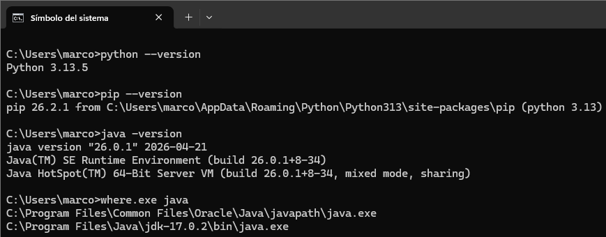

**Resultado:**

- Python 3.13.5 y pip 26.2.1 ya instalados.
- Tengo dos versiones de Java: 26.0.1 y 17.0.2. La activa es la **26.0.1**, porque la primera ruta del `PATH` es `C:\Program Files\Common Files\Oracle\Java\javapath`, que añade el instalador de Oracle.

---

## 2. Instalación de JupyterLab

### 2.1 Instalar con pip

Como ya tengo Python y pip, instalo JupyterLab con pip desde el Símbolo del sistema:

```bat
pip install jupyterlab
```

Tarda un rato porque descarga muchas dependencias.

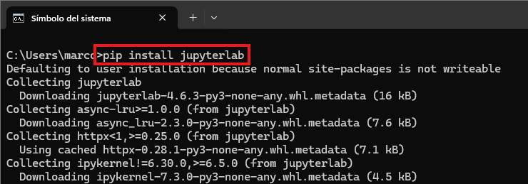

### 2.2 Problema: `jupyter` no se reconoce como comando

Al comprobar la instalación, Windows no encontraba el comando:

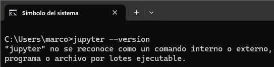

**Causa:** pip instaló JupyterLab para mi usuario, y el ejecutable `jupyter.exe` quedó en una carpeta `Scripts` que no estaba en el `PATH`:

```text
C:\Users\marco\AppData\Roaming\Python\Python313\Scripts
```

Probé a añadir `C:\Python313` al `PATH`, pero seguía igual porque esa no es la carpeta donde está `jupyter.exe`.

**Solución:**

1. Tecla Windows --> "variables de entorno" --> *Editar las variables de entorno del sistema* --> *Variables de entorno...*
2. En *Variables de usuario* selecciono `Path` --> *Editar* --> *Nuevo* y pego la ruta de `Scripts` anterior.
3. Acepto todas las ventanas.
4. Cierro todas las consolas y abro una nueva. Las consolas que ya estaban abiertas no ven el cambio del `PATH`.

Mientras no estaba arreglado, `python -m jupyterlab --version` sí funcionaba, porque no depende del `PATH`.

### 2.3 Comprobar la versión

En una consola nueva:

```bat
where.exe jupyter
jupyter lab --version
jupyter kernelspec list
```

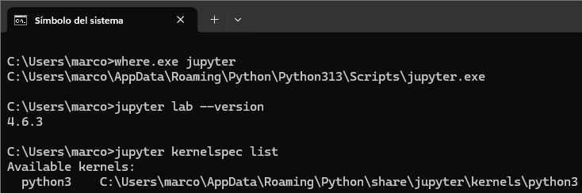

Ya se encuentra `jupyter.exe`, la versión es **4.6.3** y el único kernel registrado es `python3`.

### 2.4 Iniciar JupyterLab

Me sitúo en la carpeta de la práctica y lo arranco:

```bat
cd "C:\Users\marco\Desktop\Tajamar\Practica 01 - Primeros pasos con Scala"
jupyter lab
```

En la terminal aparece la URL del servidor.

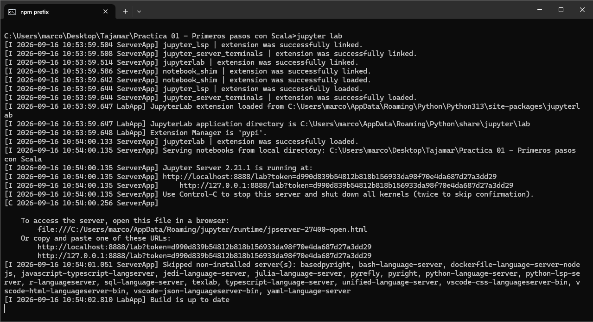

- El navegador (Google Chrome) se abre solo en `http://localhost:8888/lab`.
- La terminal tiene que quedarse abierta mientras uso JupyterLab. Para pararlo, pulso `Ctrl+C`.


---

## 3. Instalación de Almond Kernel

Según la [documentación de Almond](https://almond.sh/docs/quick-start-install), primero hay que instalar **Coursier**, el gestor de aplicaciones de Scala.

### 3.1 Instalar Coursier

Sigo los pasos de la [documentación de Coursier](https://get-coursier.io/docs/cli-installation) para Windows. En PowerShell, dentro de la carpeta de la práctica:

```powershell
Invoke-WebRequest -Uri "https://github.com/coursier/launchers/raw/master/cs-x86_64-pc-win32.zip" -OutFile "cs-x86_64-pc-win32.zip"
Expand-Archive -Path "cs-x86_64-pc-win32.zip" -DestinationPath .
Rename-Item -Path "cs-x86_64-pc-win32.exe" -NewName "cs.exe"
Remove-Item -Path "cs-x86_64-pc-win32.zip"
.\cs setup
```

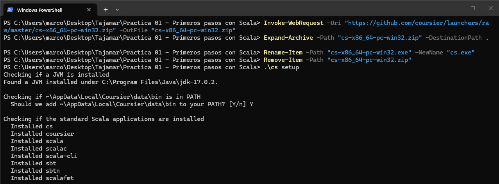

`cs setup` instala `cs`, `coursier`, `scala`, `scalac`, `scala-cli`, `sbt`, `sbtn` y `scalafmt`. El `sbt` instalado aquí es el que usaré en el Entorno 2.

### 3.2 Problema: no aparece Scala en JupyterLab y `scala` no funciona

Después de `cs setup` no salía la opción de Scala en JupyterLab y `scala -version` no funcionaba. Revisándolo:

- **`cs setup` no instala Almond.** Solo instala las herramientas estándar. El kernel de Jupyter se instala aparte (apartado 3.5).
- **`scala` no se reconocía** porque la consola ya estaba abierta antes de que `cs setup` modificara el `PATH`. Es el mismo problema que con `jupyter`: hay que abrir una consola nueva.
- **`cs setup` encontró el JDK 17** (`Found a JVM installed under C:\Program Files\Java\jdk-17.0.2`), pero `java -version` seguía dando 26.0.1. Almond arranca con el `java` del `PATH`, así que lo cambio antes de instalarlo.

### 3.3 Configurar Java 17 como versión activa

El JDK 17.0.2 ya estaba instalado; solo lo configuro:

1. Tecla Windows --> "variables de entorno" --> *Editar las variables de entorno del sistema* --> *Variables de entorno...*
2. En *Variables del sistema* --> *Nueva*: nombre `JAVA_HOME`, valor `C:\Program Files\Java\jdk-17.0.2`.
3. En *Variables del sistema* --> `Path` --> *Editar*: selecciono `C:\Program Files\Java\jdk-17.0.2\bin` y pulso *Subir* hasta dejarlo por encima de `C:\Program Files\Common Files\Oracle\Java\javapath`.
4. Acepto todo, cierro todas las consolas (y JupyterLab) y abro una PowerShell nueva.

Compruebo:

```powershell
java -version
```

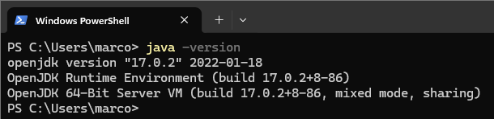

Ahora la versión activa es **OpenJDK 17.0.2**.

### 3.4 Comprobar Coursier y scala en la consola nueva

```powershell
cs version
scala --version
```

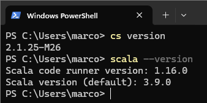

Ambos comandos funcionan: el problema era solo que la consola no veía el `PATH` nuevo.

### 3.5 Instalar Almond para Scala 2.12.21

Según las notas de versión de Almond, la **0.14.5** es la que actualiza Scala 2.12 a 2.12.21. La instalo indicando la versión exacta de Scala:

```powershell
cs launch --use-bootstrap almond:0.14.5 --scala 2.12.21 -- --install --id scala212 --display-name "Scala 2.12.21"
```

| Parte del comando | Significado |
|---|---|
| `almond:0.14.5` | Versión de Almond |
| `--scala 2.12.21` | Versión de Scala que usará el kernel |
| `--` | Separa las opciones de `cs` de las opciones de Almond |
| `--install` | Registra el kernel en Jupyter |
| `--id scala212` | Identificador interno del kernel |
| `--display-name "Scala 2.12.21"` | Nombre que se ve en JupyterLab |

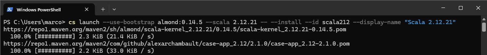

Al terminar, confirma que el kernel se ha instalado:

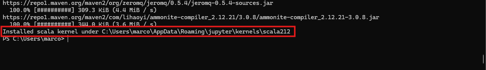

### 3.6 Comprobar que Jupyter ve el kernel

```powershell
jupyter kernelspec list
```

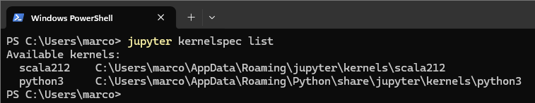

Ahora aparecen dos kernels: `python3` y `scala212`.

### 3.7 Scala disponible en JupyterLab

Vuelvo a arrancar JupyterLab con `jupyter lab`. Al crear un notebook, en el selector de kernel ya aparece **Scala 2.12.21** junto a Python 3:

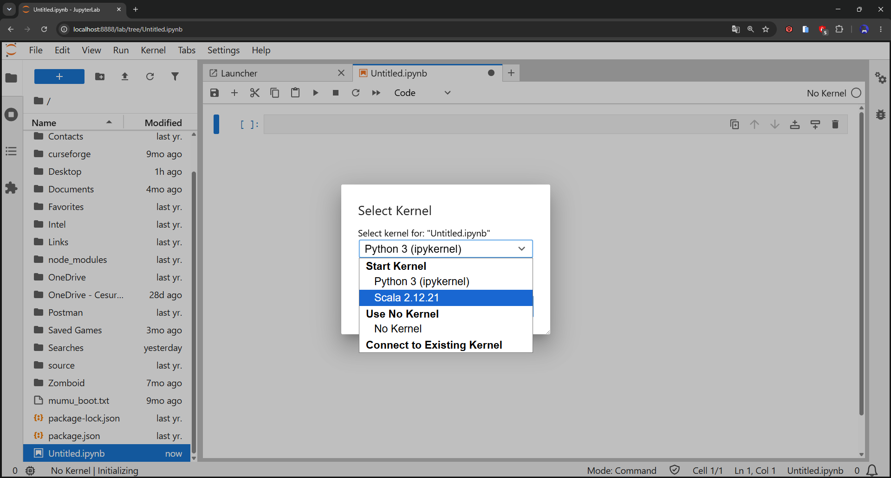

---

## 4. Verificación de la versión de Scala

### 4.1 Crear el notebook dentro del repositorio

1. Desde el explorador de archivos de JupyterLab, con el botón *New Folder*, creo la ruta `marcomartinez-practica-scala/parte1/notebook/`. Así el notebook se guarda directamente en el repositorio.
2. Dentro de `notebook/`, creo un notebook con el kernel **Scala 2.12.21**.
3. Clic derecho sobre `Untitled.ipynb` --> *Rename* --> `entorno-scala.ipynb`.

### 4.2 Celda de título

Cambio el tipo de la primera celda de *Code* a *Markdown* y escribo:

```markdown
# Entorno 1 — JupyterLab + Almond + Scala 2.12.21
```

### 4.3 Celda de comprobación de versiones

Escribo esta celda y la ejecuto con el botón de ejecutar:

```scala
println(s"Scala: ${scala.util.Properties.versionNumberString}")
println(s"Java: ${System.getProperty("java.version")}")
```

- `scala.util.Properties.versionNumberString` devuelve la versión de Scala con la que se ejecuta el código.
- `System.getProperty("java.version")` devuelve la versión de la JVM donde corre el kernel.
- `s"..."` es la interpolación de Strings: `${...}` inserta el resultado de la expresión en el texto.

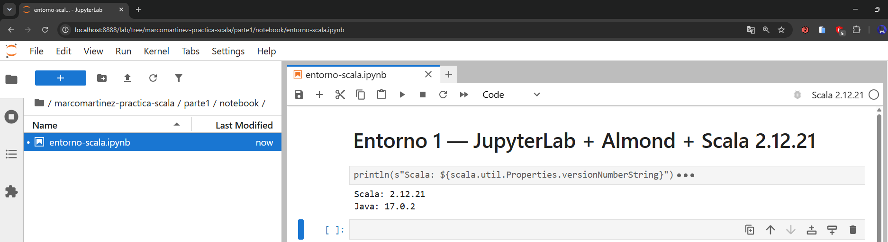

**Salida obtenida:**

```text
Scala: 2.12.21
Java: 17.0.2
```

En la captura se ve el nombre del notebook, su ruta dentro del repositorio, el kernel **Scala 2.12.21** arriba a la derecha y la salida de la celda. Esto demuestra que el notebook usa Almond con **Scala 2.12.21** sobre el **JDK 17**.

---

## 5. Ejecución de código Scala

En el mismo notebook creo tres celdas de código y ejecuto cada una con el botón de ejecutar.

### Prueba 1: variables y texto

```scala
val nombre = "Scala"
val version = "2.12.21"

println(s"Hola desde $nombre $version")
```

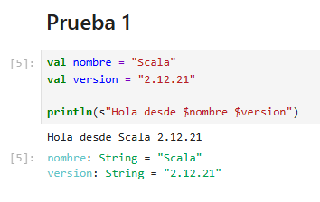

**Salida obtenida:**

```text
Hola desde Scala 2.12.21
nombre: String = "Scala"
version: String = "2.12.21"
```

### Prueba 2: operación numérica

```scala
val a = 10
val b = 20
val resultado = a + b

println(resultado)
```

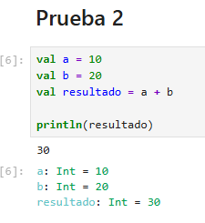

**Salida obtenida:**

```text
30
a: Int = 10
b: Int = 20
resultado: Int = 30
```

### Prueba 3: colección sencilla

```scala
val lenguajes = List("Scala", "Java", "Python")

println(lenguajes)
```

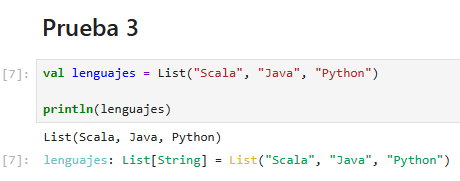

**Salida obtenida:**

```text
List(Scala, Java, Python)
lenguajes: List[String] = List("Scala", "Java", "Python")
```

### Notebook completo

Vista general del notebook con todas las celdas ejecutadas y el kernel **Scala 2.12.21** activo:

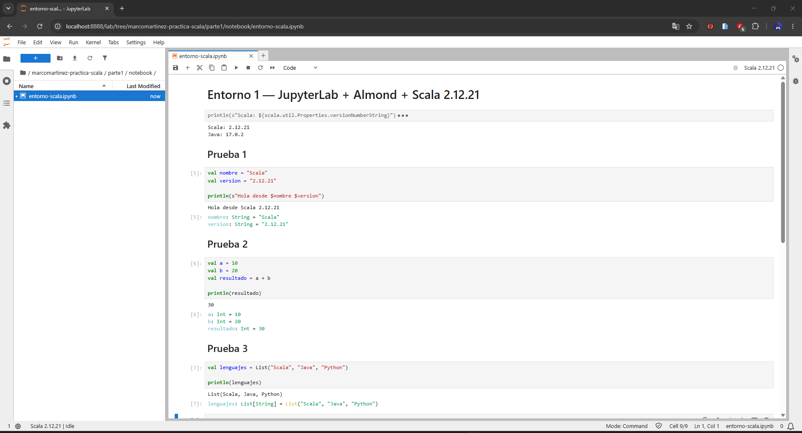

El notebook se guarda con las salidas, así se pueden ver los resultados:

[`notebook/entorno-scala.ipynb`](notebook/entorno-scala.ipynb)

Ninguna de las pruebas dio error.

---

## 6. Resumen

| Elemento | Valor |
|---|---|
| JupyterLab | 4.6.3 (instalado con pip) |
| Navegador / URL | Google Chrome, `http://localhost:8888/lab` |
| Versión Coursier | 2.1.25-M26 |
| Versión Almond | 0.14.5 |
| Kernel | `scala212`, mostrado como "Scala 2.12.21" |
| Scala en el notebook | 2.12.21 |
| Java del kernel | 17.0.2 (`JAVA_HOME = C:\Program Files\Java\jdk-17.0.2`) |
| Notebook | `parte1/notebook/entorno-scala.ipynb` |

**Problemas encontrados y resueltos:**

1. `jupyter` no se reconocía --> añadir la carpeta `Scripts` de Python al `PATH` del usuario y abrir una consola nueva.
2. Java 26 activo en lugar de Java 17 --> crear `JAVA_HOME` y subir `jdk-17.0.2\bin` por encima de `javapath` en el `PATH`.
3. `scala` no se reconocía tras `cs setup` --> abrir una consola nueva.
4. No aparecía Scala en JupyterLab --> `cs setup` no instala Almond; hay que instalarlo con `cs launch almond`.
