# Entorno 2: Visual Studio Code + Metals + sbt + Scala 2.12.21

[← Volver a la Parte 1](README.md)

En este entorno paso de ejecutar código suelto en un notebook a un **proyecto Scala estructurado con sbt**.

Parte de lo necesario ya lo tenía del [Entorno 1](entorno1-jupyterlab.md):

- **JDK 17.0.2:** configurado en el Entorno 1 (`JAVA_HOME` y `PATH`). Aquí solo lo verifico.
- **sbt:** instalado con `cs setup` (Coursier) en el Entorno 1. Aquí solo lo verifico.
- **Visual Studio Code:** ya lo tenía instalado.
- **Metals:** es lo único que instalo nuevo.

Todos los comandos de este apartado los ejecuto en **PowerShell**.

## Índice

1. [Comprobar el JDK 17](#1-comprobar-el-jdk-17)
2. [Visual Studio Code](#2-visual-studio-code)
3. [Instalar la extensión Scala (Metals)](#3-instalar-la-extensión-scala-metals)
4. [Comprobar sbt](#4-comprobar-sbt)
5. [Crear el proyecto Scala con sbt](#5-crear-el-proyecto-scala-con-sbt)
6. [Configurar Scala 2.12.21 en build.sbt](#6-configurar-scala-21221-en-buildsbt)
7. [Programa Main.scala](#7-programa-mainscala)
8. [Importar el proyecto con Metals](#8-importar-el-proyecto-con-metals)
9. [Compilar con sbt compile](#9-compilar-con-sbt-compile)
10. [Ejecutar con sbt run](#10-ejecutar-con-sbt-run)
11. [Resumen](#11-resumen)

---

## 1. Comprobar el JDK 17

```powershell
java -version
javac -version
```

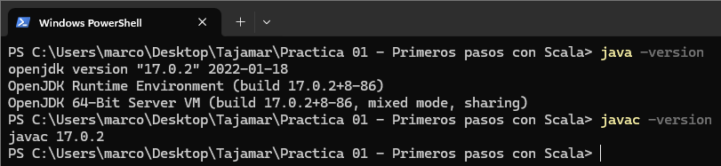

Los dos comandos devuelven **17.0.2**.

---

## 2. Visual Studio Code

Compruebo si ya lo tengo instalado:

```powershell
code --version
```

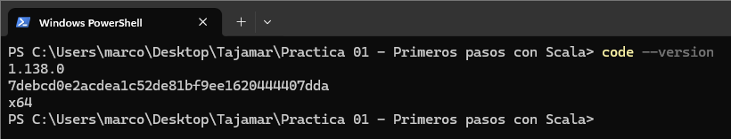

Sale un número de versión, así que ya está instalado. Lo confirmo también desde *Help --> About*:

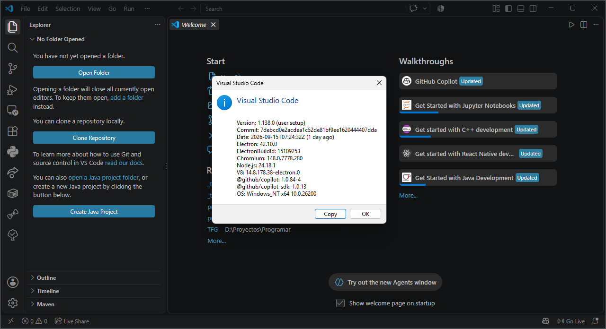

**Versión: 1.138.0 (user setup)**.

Pantalla de inicio de VS Code:

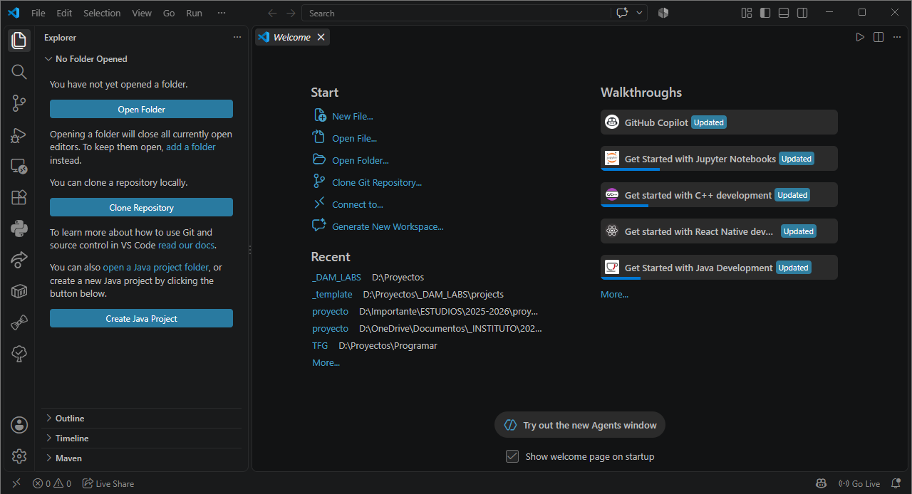

---

## 3. Instalar la extensión Scala (Metals)

1. Abro el panel de extensiones.
2. Busco **Scala (Metals)**. El creador es *Scalameta*.
3. Pulso *Install*.

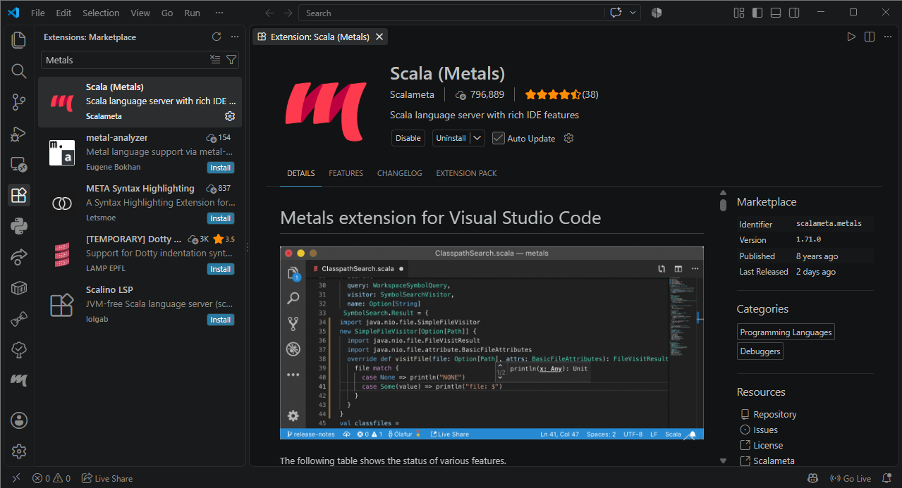

En el panel derecho se ve el identificador `scalameta.metals` y la **versión 1.71.0** de la extensión.

Metals añade autocompletado, errores en tiempo real, navegación por el código y la importación de proyectos sbt, útil para programar en Scala.

---

## 4. Comprobar sbt

```powershell
sbt --version
```

**sbt** compila, ejecuta y prueba proyectos Scala.

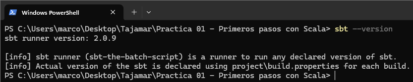

### Decisión: qué versión de sbt uso en el proyecto

`sbt --version` devuelve `sbt runner version: 2.0.9`.

- **sbt 2.x** es muy reciente. Puede compilar proyectos Scala 2.12, pero el ecosistema (plugins, importación en los IDE) todavía se está adaptando.
- **sbt 1.x** (1.12.13) es la versión estable con mejor soporte en Metals e IntelliJ.

Por eso uso **sbt 1.12.13** en los proyectos de la práctica. El lanzador 2.0.9 lo ejecuta sin problema.

---

## 5. Crear el proyecto Scala con sbt

El proyecto está dentro del repositorio, en:

```text
marcomartinez-practica-scala/parte1/scala-vscode
```

1. Creo la carpeta `scala-vscode` dentro de `parte1`.
2. Copio en ella los archivos del proyecto que tenía preparados.
3. En VS Code: *File --> Open Folder...* y abro la carpeta `scala-vscode`.

**Estructura del proyecto:**

```text
scala-vscode/
├── .gitignore
├── build.sbt
├── project/
│   └── build.properties
└── src/
    └── main/
        └── scala/
            └── Main.scala
```

| Archivo o carpeta | Para qué sirve |
|---|---|
| `build.sbt` | Configuración del proyecto: nombre, versión y versión de Scala |
| `project/` | Configuración de sbt en sí |
| `project/build.properties` | Fija la versión de sbt del proyecto |
| `src/main/scala/` | Código fuente. Es la convención de sbt (igual que en Maven): sbt busca aquí el código sin configurar nada |
| `.gitignore` | Indica a Git qué carpetas y archivos generados no se deben subir al repositorio |

Contenido de `project/build.properties`:

```properties
sbt.version=1.12.13
```

Contenido de `.gitignore`:

```gitignore
# sbt
target/
project/target/
project/project/

# Metals / Bloop / BSP
.metals/
.bloop/
.bsp/
project/metals.sbt

# VS Code
.vscode/
```

Excluye las carpetas que generan sbt, Metals, Bloop y VS Code. Son locales de mi equipo, se regeneran solas al abrir o compilar el proyecto y no forman parte del código.

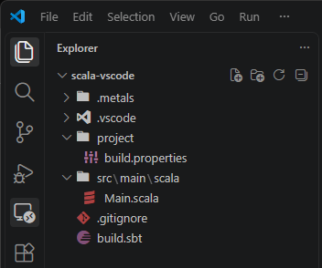

En la captura ya aparecen `.metals` y `.vscode`, que crea Metals al abrir la carpeta.

---

## 6. Configurar Scala 2.12.21 en build.sbt

```scala
name := "scala-vscode"
version := "0.1.0"
scalaVersion := "2.12.21"
```

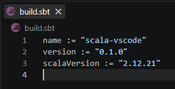

---

## 7. Programa Main.scala

Archivo `src/main/scala/Main.scala`. He añadido el espacio que faltaba en el enunciado después de `desde:`.

```scala
object Main extends App {

  val entorno = "Visual Studio Code"

  println("Práctica de programación básica con Scala")
  println(s"Ejecutando desde: $entorno")
}
```

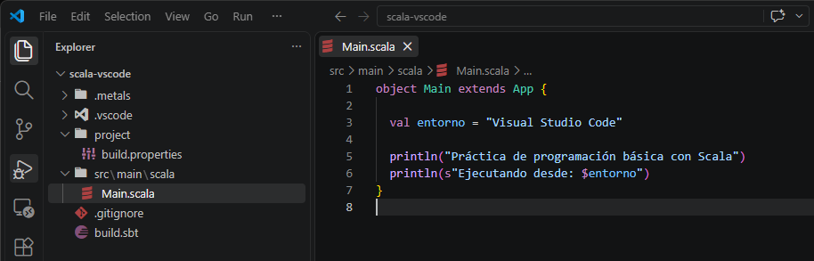

---

## 8. Importar el proyecto con Metals

Al abrir la carpeta con `build.sbt`, Metals muestra abajo a la derecha el aviso *"New sbt workspace detected, would you like to import the build?"*. Pulso **Import build**.

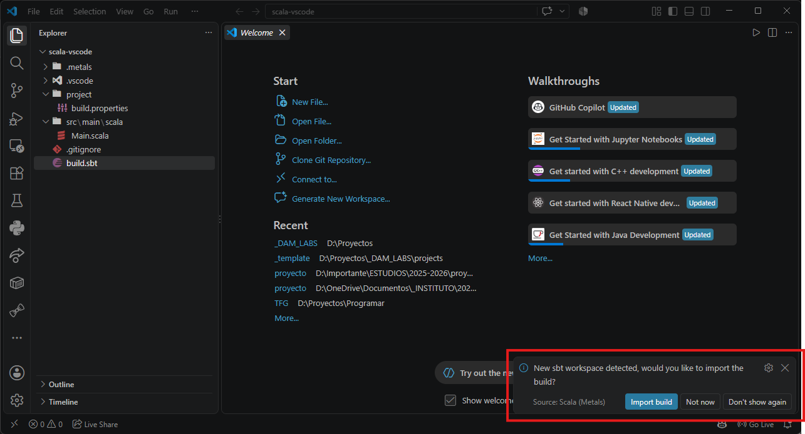

Para comprobar que Metals ha reconocido el proyecto, abro el panel de Metals (icono **m** de la barra lateral) --> **Run doctor**:

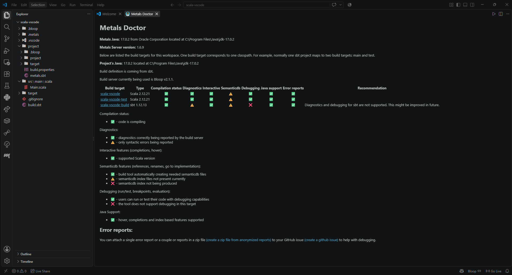

**Cómo leo el Metals Doctor:**

Metals crea carpetas propias (`.metals/`, `.bloop/`, `.bsp/`, `.vscode/`, `project/metals.sbt`). Están en el `.gitignore` y no se suben a GitHub.

---

## 9. Compilar con sbt compile

Abro la terminal integrada (*Terminal --> New Terminal*), que ya está situada en la carpeta del proyecto, y ejecuto:

```powershell
sbt compile
```

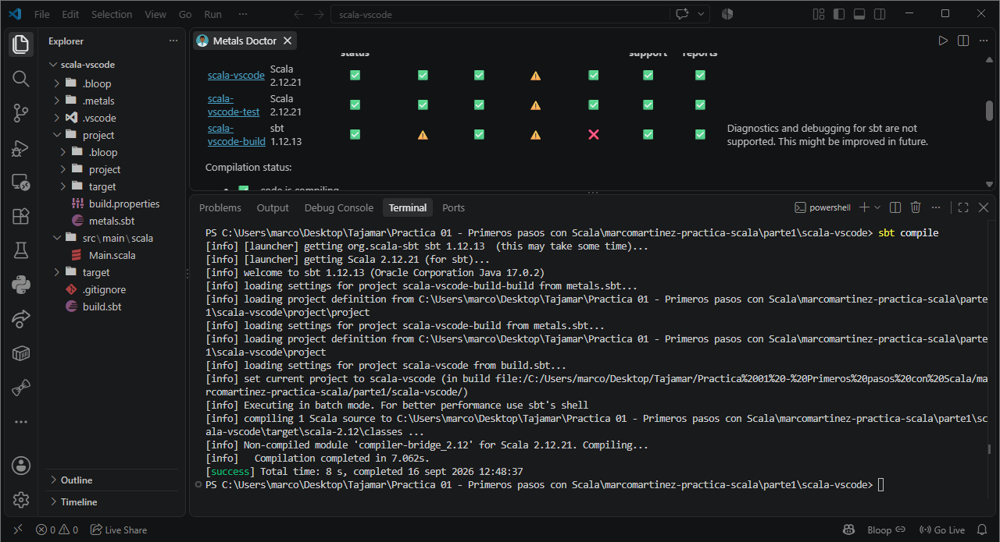

En la salida se ve `welcome to sbt 1.12.13 (Oracle Corporation Java 17.0.2)`, `compiling 1 Scala source` y el mensaje final **`[success]`**.

---

## 10. Ejecutar con sbt run

```powershell
sbt run
```

`sbt run` compila si hay cambios y ejecuta el objeto que tiene punto de entrada (`Main`).

### Problema: las tildes salen mal

La salida fue:

```text
[info] running Main
Práctica de programación básica con Scala
Ejecutando desde: Visual Studio Code
[success] Total time: 0 s
```

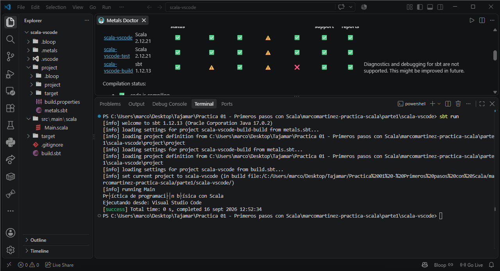

El programa se ejecuta correctamente (`running Main` y `[success]`), pero la línea con tildes no se ve bien:

- **No es un error del código:** en `Main.scala` el texto está bien escrito (se ve en la captura del apartado 7) y la segunda línea, que no tiene tildes, sale perfecta.
- **Causa:** `Main.scala` está guardado en UTF-8, donde cada letra con tilde ocupa 2 bytes.

**Solución (no aplicada):** cambiar la terminal a UTF-8 antes de ejecutar.

No lo he aplicado porque no afecta al funcionamiento del programa, solo a cómo la consola muestra los caracteres.

---

## 11. Resumen

| Elemento | Valor |
|---|---|
| Java / javac | 17.0.2 |
| Visual Studio Code | 1.138.0 (user setup) |
| Extensión Scala (Metals) | 1.71.0 (servidor Metals 1.6.9) |
| Lanzador de sbt | 2.0.9 |
| sbt del proyecto | 1.12.13 |
| Scala del proyecto | 2.12.21 |
| Proyecto | [`parte1/scala-vscode`](scala-vscode/) |
| `sbt compile` | `[success]` |
| `sbt run` | `[success]` (tildes mal en la consola de Windows) |

**Archivos del proyecto:**

- [`build.sbt`](scala-vscode/build.sbt)
- [`project/build.properties`](scala-vscode/project/build.properties)
- [`src/main/scala/Main.scala`](scala-vscode/src/main/scala/Main.scala)
- [`.gitignore`](scala-vscode/.gitignore)

**Problema encontrado:** las tildes salen mal en `sbt run` por la codificación de la consola de Windows. **No corregido**; la solución sería cambiar la terminal a UTF-8 antes de `sbt run`.
