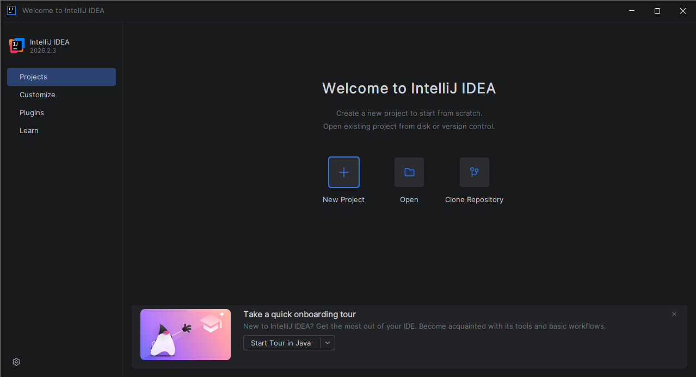
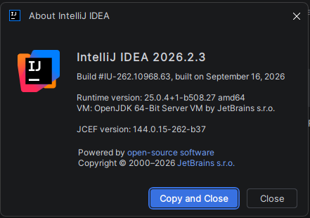
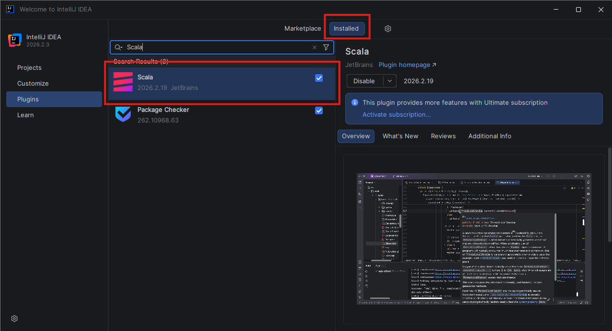
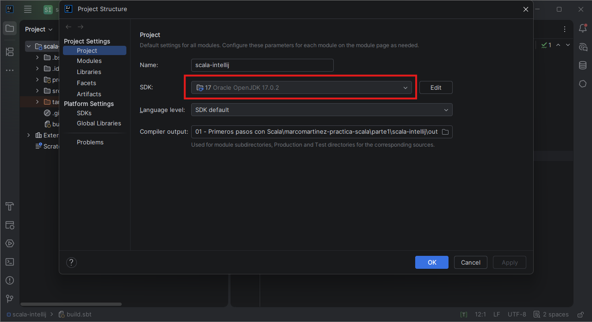
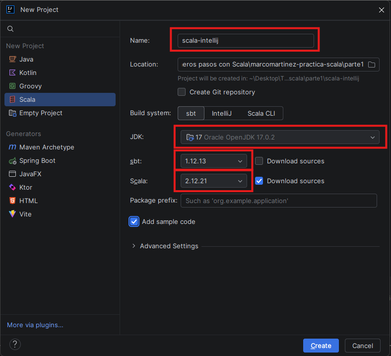
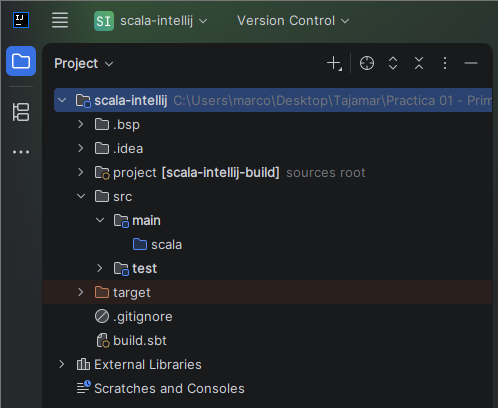
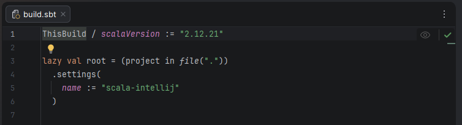
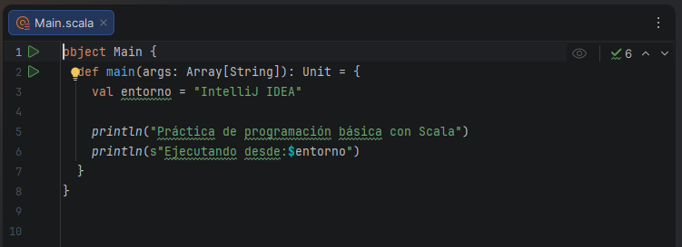
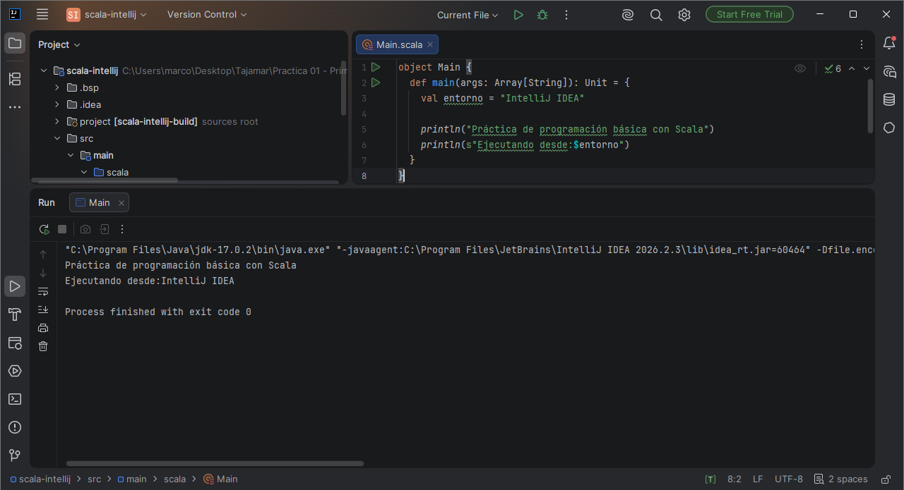
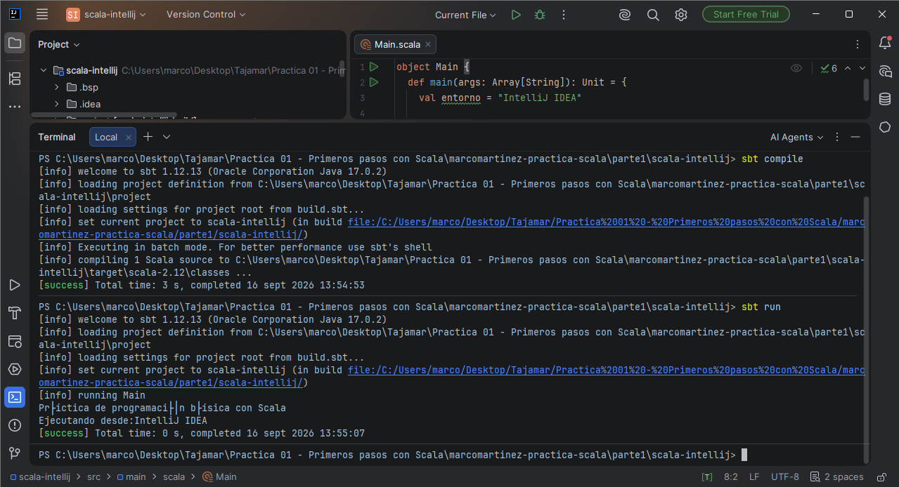

# Entorno 3: IntelliJ IDEA + Scala Plugin + sbt + Scala 2.12.21

[← Volver a la Parte 1](README.md)

El tercer entorno es un **IDE completo**. Del [Entorno 1](entorno1-jupyterlab.md) y el [Entorno 2](entorno2-vscode.md) ya tenía el JDK 17.0.2 y sbt, así que aquí instalo IntelliJ IDEA y su plugin de Scala y creo el proyecto con el asistente del propio IDE.

## Índice

1. [Instalar IntelliJ IDEA](#1-instalar-intellij-idea)
2. [Instalar el plugin de Scala](#2-instalar-el-plugin-de-scala)
3. [Configurar el JDK 17](#3-configurar-el-jdk-17)
4. [Crear el proyecto sbt scala-intellij](#4-crear-el-proyecto-sbt-scala-intellij)
5. [Revisar build.sbt](#5-revisar-buildsbt)
6. [Programa Main.scala](#6-programa-mainscala)
7. [Ejecutar desde IntelliJ IDEA](#7-ejecutar-desde-intellij-idea)
8. [Ejecutar con sbt desde la terminal](#8-ejecutar-con-sbt-desde-la-terminal)
9. [Resumen](#9-resumen)

## IntelliJ IDEA Community Edition y Ultimate ya no se pueden conseguir por separado

El enunciado pide **IntelliJ IDEA Community Edition**, pero JetBrains unió Community y Ultimate en una sola descarga llamada **IntelliJ IDEA**:

Todo lo que incluía Community (Java, Kotlin, sbt/Maven/Gradle y plugins como el de Scala) sigue siendo **gratuito**.

---

## 1. Instalar IntelliJ IDEA

No lo tenía instalado. Lo descargué de [jetbrains.com/idea/download](https://www.jetbrains.com/idea/download/) (instalador `.exe` para Windows) y lo instalé con las opciones por defecto.

En el primer arranque pide aceptar el acuerdo de usuario de JetBrains:


Después aparece la pantalla de bienvenida, desde donde se crean o abren proyectos y se gestionan los plugins:



Compruebo la versión en *Help --> About*:



**Versión: IntelliJ IDEA 2026.2.3**.

---

## 2. Instalar el plugin de Scala

IntelliJ no trae soporte para Scala de serie. Hay que instalar el plugin oficial:

1. En la pantalla de bienvenida --> **Plugins** (con un proyecto abierto: *File --> Settings --> Plugins*, `Ctrl+Alt+S`).
2. Pestaña **Marketplace** --> busco `Scala`. El plugin es **Scala**, de *JetBrains*.
3. **Install** --> cuando termina reinicio IntelliJ.

Tras reiniciar, el plugin aparece en la pestaña **Installed**:



**Plugin Scala 2026.2.19** (JetBrains), activado.

---

## 3. Configurar el JDK 17

El JDK se elige al crear el proyecto (apartado 4), en el desplegable **JDK**.

Con el proyecto ya creado compruebo que usa Java 17 en *File --> Project Structure* (`Ctrl+Alt+Shift+S`) --> **Project**:



El SDK del proyecto es **17 – Oracle OpenJDK 17.0.2**, el mismo JDK configurado con `JAVA_HOME` en el Entorno 1.

---

## 4. Crear el proyecto sbt scala-intellij

*New Project* --> a la izquierda elijo **Scala** y relleno el asistente:



| Campo | Valor | Motivo |
|---|---|---|
| Name | `scala-intellij` | Nombre pedido en el enunciado |
| Location | `...\marcomartinez-practica-scala\parte1` | IntelliJ crea dentro la carpeta `scala-intellij`, igual que `scala-vscode` |
| Build system | **sbt** | Herramienta de construcción pedida |
| JDK | **17** (Oracle OpenJDK 17.0.2) | Versión de Java de la práctica |
| sbt | **1.12.13** | La misma que en VS Code |
| Scala | **2.12.21** | Versión de Scala de la práctica |
| Add sample code | Marcado | Crea `src/main/scala/Main.scala` |

Al pulsar *Create*, IntelliJ importa el proyecto con sbt. La primera vez tarda porque descarga sbt y Scala.

> **Importante:** el desplegable **sbt** propone por defecto la **2.0.9** (la versión del lanzador instalado). Hay que cambiarla a mano a **1.12.13**. En el apartado 7 explico qué pasó la primera vez que no lo hice.

Estructura del proyecto en el panel *Project*:



```text
scala-intellij/
├── .gitignore
├── build.sbt
├── project/
│   └── build.properties
└── src/
    ├── main/
    │   └── scala/
    │       └── Main.scala
    └── test/
        └── scala/
```

| Archivo o carpeta | Para qué sirve |
|---|---|
| `build.sbt` | Configuración del proyecto: nombre y versión de Scala |
| `project/build.properties` | Fija la versión de sbt del proyecto |
| `src/main/scala/` | Código fuente del programa |
| `src/test/scala/` | Código de tests (vacío en esta práctica) |
| `.gitignore` | Archivos y carpetas generados que no se suben al repositorio |

Las carpetas `.idea/`, `.bsp/` y `target/` que se ven en la captura las genera IntelliJ o sbt. Son locales de mi equipo y no se suben a GitHub.

Contenido de `project/build.properties`:

```properties
sbt.version = 1.12.13
```

---

## 5. Revisar build.sbt

IntelliJ ha generado este `build.sbt`:

```scala
ThisBuild / scalaVersion := "2.12.21"

lazy val root = (project in file("."))
  .settings(
    name := "scala-intellij"
  )
```



Es **equivalente** al del enunciado (`scalaVersion := "2.12.21"` y `name := "scala-intellij"`), aunque está escrito de otra forma:

---

## 6. Programa Main.scala

Archivo `src/main/scala/Main.scala`:

```scala
object Main {
  def main(args: Array[String]): Unit = {
    val entorno = "IntelliJ IDEA"

    println("Práctica de programación básica con Scala")
    println(s"Ejecutando desde:$entorno")
  }
}
```



- `def main(args: Array[String]): Unit` es el punto de entrada clásico de la JVM, igual que `public static void main` en Java. `args` son los argumentos de la línea de comandos y `Unit` equivale a `void`.
- Es **equivalente** a `object Main extends App`, la forma que usé en [VS Code](entorno2-vscode.md#7-programa-mainscala): `App` crea el método `main` por mí y ejecuta el cuerpo del `object`. Las dos formas son válidas en Scala 2.12 y tanto IntelliJ como sbt detectan cualquiera como clase principal.

---

## 7. Ejecutar desde IntelliJ IDEA

Pulso el triángulo verde que aparece junto a `object Main`, en el margen izquierdo --> **Run 'Main'**. IntelliJ compila el proyecto y abre la ventana **Run** con la salida:



**Salida obtenida:**

```text
Práctica de programación básica con Scala
Ejecutando desde:IntelliJ IDEA

Process finished with exit code 0
```

### Problema: `Could not find or load main class Main`

La primera vez que creé el proyecto, al ejecutar `Main` desde IntelliJ salió:

```text
Error: Could not find or load main class Main
Caused by: java.lang.ClassNotFoundException: Main

Process finished with exit code 1
```

- La JVM no encontraba `Main.class`. En el comando que lanzaba IntelliJ, el `-classpath` solo contenía `scala-library-2.12.21.jar`, no la carpeta con mis clases compiladas.
- **Causa:** el proyecto había quedado mal configurado:
  1. Se creó con **sbt 2.0.9**, la versión que el asistente propone por defecto, en lugar de la 1.12.13.
  2. Tenía **dos módulos apuntando al mismo código**: el que crea sbt (`scala-intellij.main`) y otro extra (`scala-intellij`). La ejecución usaba el classpath del módulo equivocado.
- **Solución:** cerré el proyecto, borré la carpeta `scala-intellij` y lo volví a crear con el asistente eligiendo **sbt 1.12.13**, sin tocar *Project Structure --> Modules*. Con el proyecto nuevo, *Run 'Main'* funcionó a la primera.

---

## 8. Ejecutar con sbt desde la terminal

Además de ejecutarlo con el IDE, compruebo que el proyecto funciona con sbt desde la línea de comandos. Abro la terminal integrada (*View --> Tool Windows --> Terminal*, `Alt+F12`), que ya está situada en la carpeta del proyecto, y ejecuto:

```powershell
sbt compile
sbt run
```



**`sbt compile`:**

Termina con **`[success]`**.

**`sbt run`:**

```text
[info] running Main
Práctica de programación básica con Scala
Ejecutando desde:IntelliJ IDEA
[success] Total time: 0 s
```

El programa se ejecuta y termina con `[success]`, pero la línea con tildes sale mal. Es el mismo problema de codificación que en el [Entorno 2](entorno2-vscode.md#problema-las-tildes-salen-mal):

- `Main.scala` está en UTF-8, y la consola de Windows usa por defecto otro formato.
- Desde el botón *Run* de IntelliJ (apartado 7) sale bien, porque IntelliJ lanza la JVM con `-Dfile.encoding=UTF-8` y su consola usa UTF-8.
- **Solución (no aplicada):** cambiar la terminal a UTF-8 antes de ejecutar.

---

## 9. Resumen

| Elemento | Valor |
|---|---|
| IntelliJ IDEA | 2026.2.3 (Build #IU-262.10968.63), modo gratuito |
| Plugin Scala | 2026.2.19 (JetBrains) |
| SDK del proyecto | 17 – Oracle OpenJDK 17.0.2 |
| sbt del proyecto | 1.12.13 |
| Scala del proyecto | 2.12.21 |
| Proyecto | [`parte1/scala-intellij`](scala-intellij/) |
| Ejecución desde IntelliJ | Salida correcta, `exit code 0` |
| `sbt compile` | `[success]` |
| `sbt run` | `[success]` (tildes mal en la consola de Windows) |

**Archivos del proyecto:**

- [`build.sbt`](scala-intellij/build.sbt)
- [`project/build.properties`](scala-intellij/project/build.properties)
- [`src/main/scala/Main.scala`](scala-intellij/src/main/scala/Main.scala)
- [`.gitignore`](scala-intellij/.gitignore)

**Problemas encontrados:**

1. `ClassNotFoundException: Main` al ejecutar desde IntelliJ --> proyecto creado con sbt 2.0.9 y con un módulo duplicado. **Resuelto** recreando el proyecto con sbt 1.12.13.
2. Tildes mal en `sbt run` desde la terminal --> las tildes salen mal en sbt run por la codificación de la consola de Windows. No corregido; la solución sería cambiar la terminal a UTF-8 antes de sbt run.
