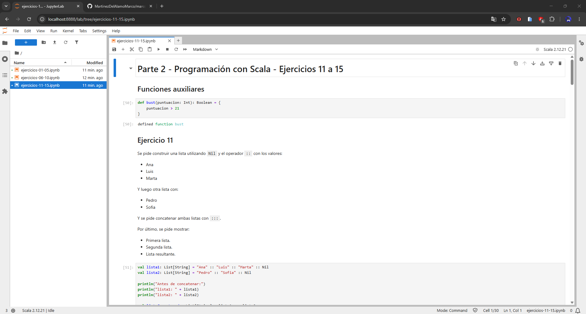
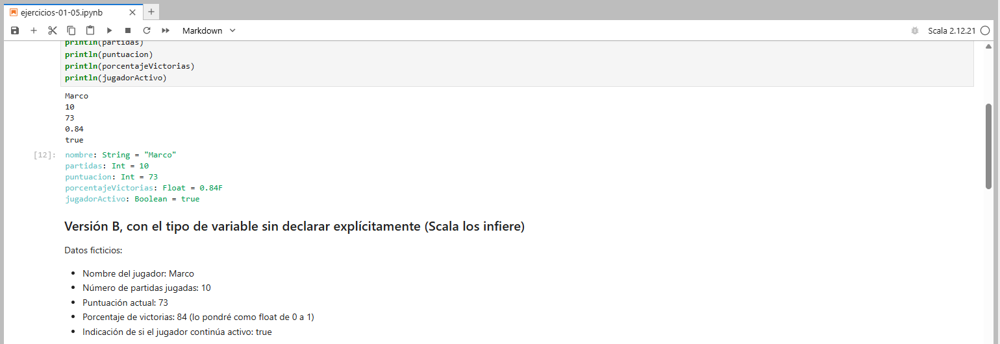
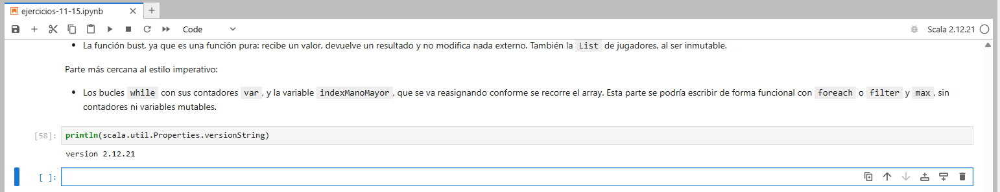
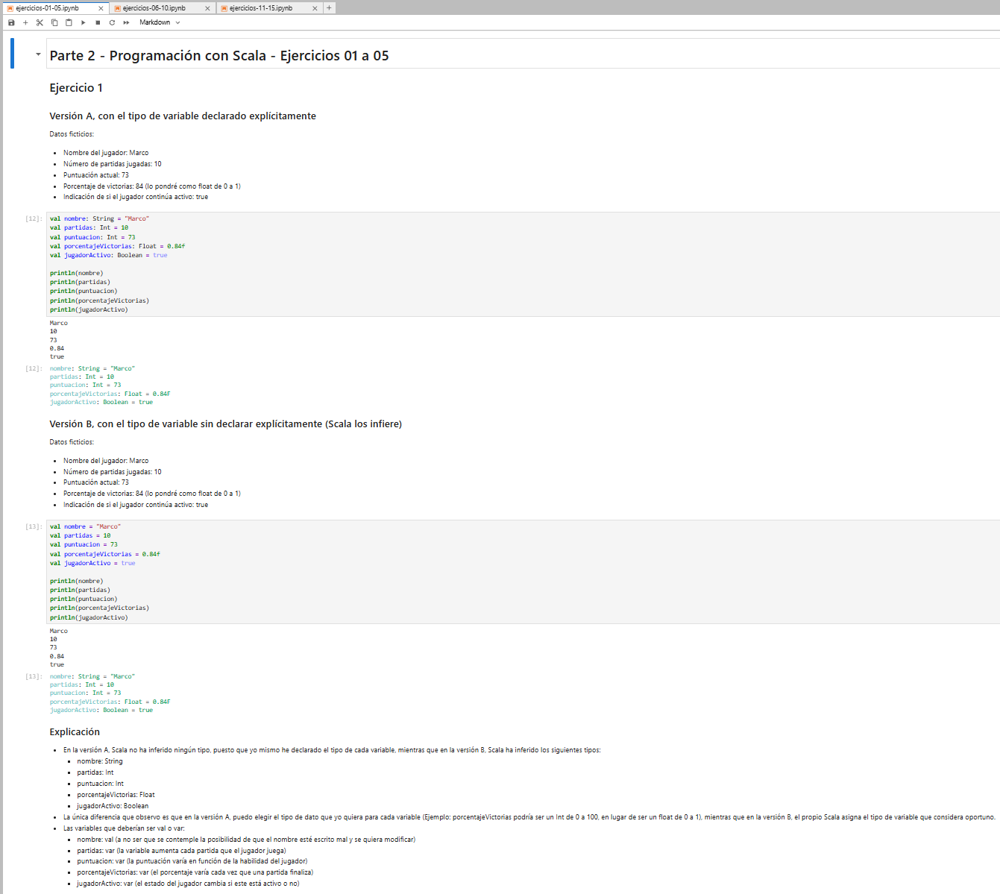
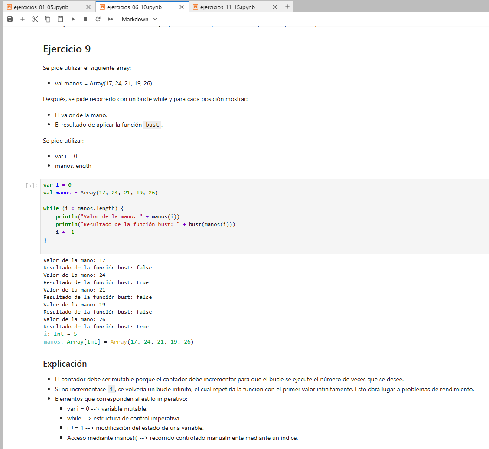
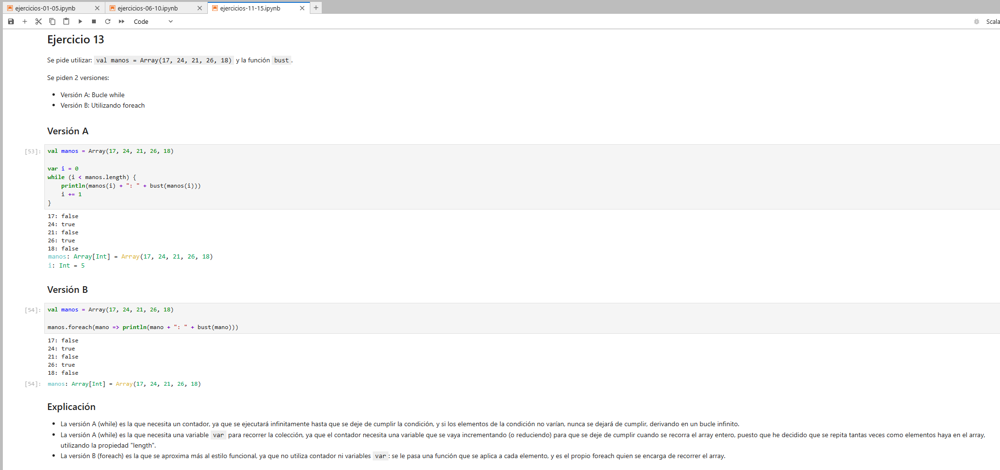
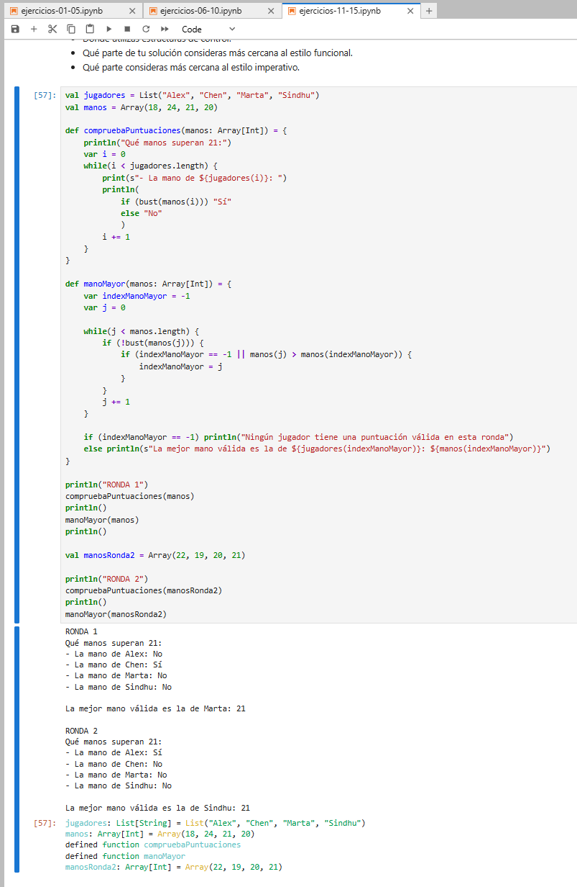

# Parte 2: Programación con Scala

[← Volver al inicio](../README.md)

El objetivo de esta parte es resolver 15 ejercicios de programación en **Scala 2.12.21**, utilizando el entorno de JupyterLab + Almond Kernel configurado en la [Parte 1](../parte1/README.md).

Los ejercicios están basados en los capítulos 1, 2 y 3 del material del curso (DataCamp), y cubren variables, tipos e inferencia, funciones, `Array`, `List`, estructuras de control, operadores relacionales y lógicos, `while`, `foreach`, mutabilidad e inmutabilidad y los estilos imperativo y funcional.

## Entorno utilizado

| Herramienta | Versión |
|---|---|
| JupyterLab | 4.6.3 |
| Almond Kernel | Scala 2.12.21 |
| Scala | 2.12.21 |
| JDK | 17.0.2 |

## Notebooks

He dividido el trabajo en tres notebooks para que cada uno sea más manejable. Los tres se pueden ejecutar de forma independiente.

| Notebook | Ejercicios | Contenido |
|---|---|---|
| [ejercicios-01-05.ipynb](notebooks/ejercicios-01-05.ipynb) | 1 a 5 | Variables, tipos, inferencia, `val` / `var`, precisión numérica y primeras funciones |
| [ejercicios-06-10.ipynb](notebooks/ejercicios-06-10.ipynb) | 6 a 10 | `if` / `else if` / `else`, `Array`, mutabilidad, bucle `while` y `List` |
| [ejercicios-11-15.ipynb](notebooks/ejercicios-11-15.ipynb) | 11 a 15 | `Nil`, `::`, `:::`, operadores, `foreach`, efectos secundarios y programa integrado |

## Contenido por ejercicio

| Ejercicio | Tema |
|---|---|
| 1 | Variables, tipos e inferencia (versión A con tipos explícitos y versión B inferida) |
| 2 | `val`, `var` y error de reasignación |
| 3 | Tipos numéricos y precisión (`Double` frente a `Float`) |
| 4 | Función `bust` |
| 5 | Función `maxHand` |
| 6 | Función `ganador` con `if` / `else if` / `else` |
| 7 | `Array` y mutabilidad, con error de tipos |
| 8 | Creación e inicialización de un `Array[Int]` |
| 9 | Recorrido de un `Array` con `while` |
| 10 | `List` e inmutabilidad (`::`, `length`, `reverse`) |
| 11 | Construcción con `Nil` y concatenación con `:::` |
| 12 | Operadores relacionales y lógicos |
| 13 | `foreach` frente a `while` |
| 14 | Efectos secundarios y estilo de programación |
| 15 | Programa integrado: torneo de Twenty-One, con dos rondas |

## Evidencias

| Captura | Descripción |
|---|---|
|  | JupyterLab abierto con los notebooks de la Parte 2 |
|  | Notebook ejecutándose con el kernel Almond |
|  | Comprobación de Scala 2.12.21 desde el notebook |
|  | Ejecución del ejercicio 1 |
|  | Ejecución del ejercicio 9 |
|  | Ejecución del ejercicio 13 |
|  | Ejecución completa del ejercicio 15 |

## Estructura de esta carpeta

```text
parte2/
├── README.md                  ← este archivo
├── notebooks/
│   ├── ejercicios-01-05.ipynb
│   ├── ejercicios-06-10.ipynb
│   └── ejercicios-11-15.ipynb
└── images/
    ├── parte2-jupyterlab.png
    ├── parte2-kernel-almond.png
    ├── parte2-scala-version.png
    ├── parte2-ejercicio-01.png
    ├── parte2-ejercicio-09.png
    ├── parte2-ejercicio-13.png
    └── parte2-ejercicio-15.png
```

Las capturas de la Parte 1 están en la carpeta [`images/`](../images/) de la raíz del repositorio. Las de esta parte están en [`parte2/images/`](images/), siguiendo la estructura recomendada en el enunciado.

## Notas sobre el enunciado

- **Tres notebooks en lugar de uno.** El enunciado permite dividir el trabajo siempre que los notebooks estén numerados y enlazados desde un archivo Markdown, que es lo que hace la tabla de arriba.
- **Funciones auxiliares.** Los notebooks 2 y 3 vuelven a definir `bust` (y `maxHand` en el segundo) en una primera celda, para que cada notebook se pueda ejecutar de principio a fin sin depender de los anteriores.
- **Celdas con error intencionado.** Los ejercicios 2 y 7 piden dejar documentado el error de compilación, así que cada uno tiene una celda que falla a propósito (`reassignment to val` y `type mismatch`). Al usar "Run All" la ejecución se detiene en esas celdas: el resto se ejecuta a continuación de forma manual.
