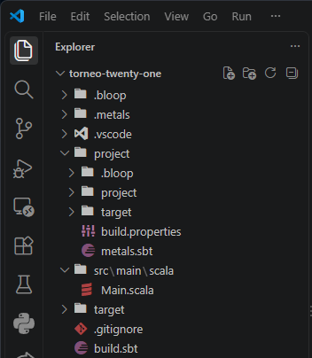
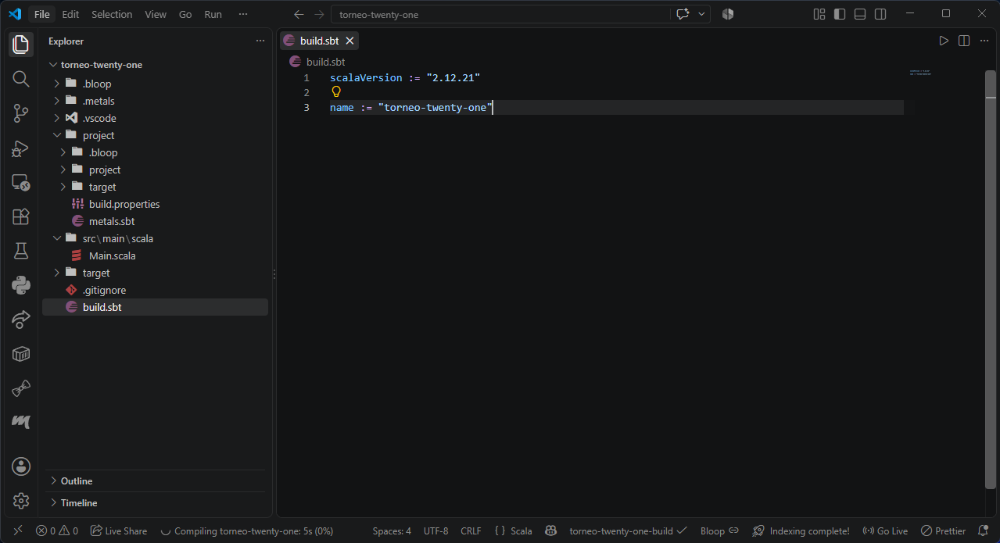
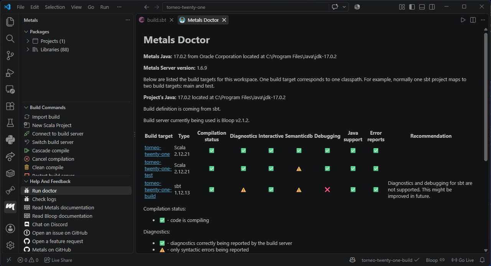
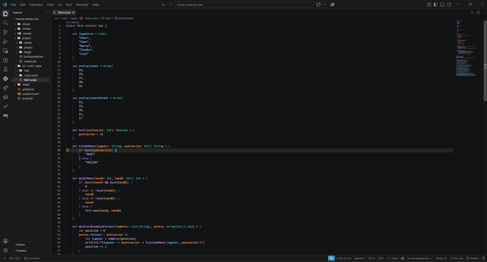
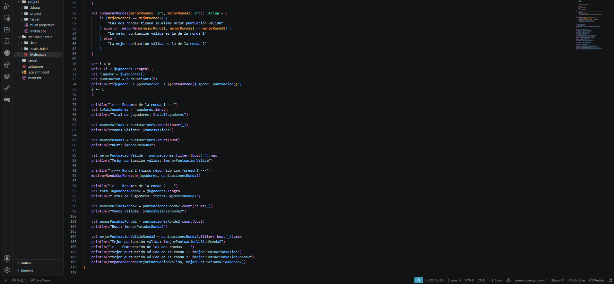
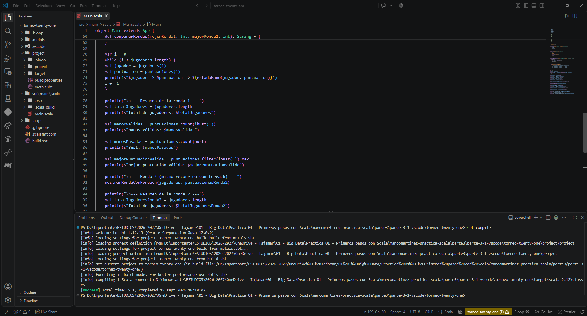
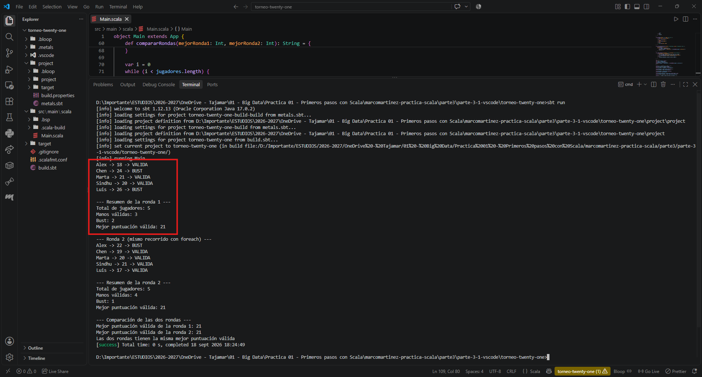
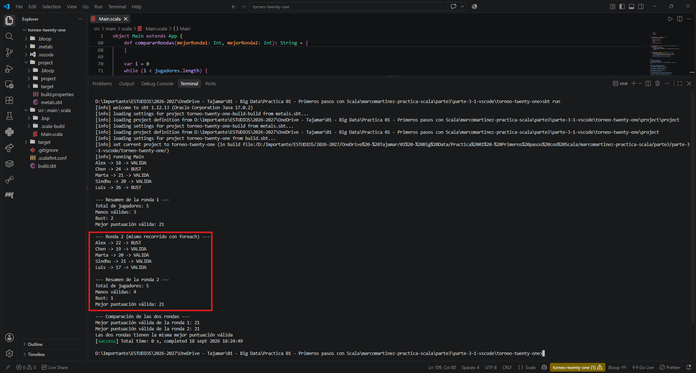
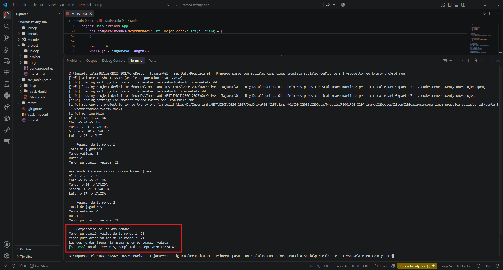

# Mini proyecto 3.1 — Torneo de Twenty-One

[← Volver a la Parte 3](../README.md)

## Entorno

| Herramienta | Versión |
|---|---|
| Visual Studio Code | 1.138.0 |
| Metals (servidor) | 1.6.9 |
| Scala | 2.12.21 |
| JDK | 17.0.2 |
| sbt | 1.12.13 (lanzador 2.0.9) |

Es el mismo entorno que configuré en el [Entorno 2 de la Parte 1](../../parte1/entorno2-vscode.md), así que aquí solo tuve que crear el proyecto nuevo y dejar que Metals lo importara.

| Captura | Qué muestra |
|---|---|
|  | El proyecto `torneo-twenty-one` abierto en VS Code, con la estructura de carpetas de sbt |
|  | `build.sbt` con `scalaVersion := "2.12.21"` y el nombre del proyecto |
|  | Metals Doctor: JDK 17.0.2, Scala 2.12.21 en los build targets y sbt 1.12.13 en la definición del build |

En el Doctor, los avisos (⚠) de Semanticdb y la ✗ de *Debugging* en el target `torneo-twenty-one-build` son los mismos que ya me salieron en la Parte 1: el propio Doctor indica que la depuración del build de sbt no está soportada, y no impide compilar ni ejecutar.

## Descripción

El programa analiza los resultados de dos rondas de un torneo de Twenty-One. Para cada jugador comprueba si se ha pasado de 21, y con esa información calcula cuántas manos son válidas, cuántas se han pasado y cuál es la mejor puntuación válida de cada ronda. Al final compara las dos rondas y dice cuál tuvo la mejor puntuación o si empatan.

La primera ronda la recorro con un bucle `while` y la segunda con `foreach`, para tener las dos versiones que pide el enunciado y poder compararlas.

## Estructura

```text
parte-3-1-vscode/
├── README.md                      ← este archivo
└── torneo-twenty-one/
    ├── .gitignore
    ├── .scalafmt.conf
    ├── build.sbt
    ├── project/
    │   └── build.properties
    └── src/
        └── main/
            └── scala/
                └── Main.scala
```

| Archivo | Para qué sirve |
|---|---|
| [`build.sbt`](torneo-twenty-one/build.sbt) | Nombre del proyecto y versión de Scala (2.12.21) |
| [`project/build.properties`](torneo-twenty-one/project/build.properties) | Fija la versión de sbt del proyecto (1.12.13) |
| [`src/main/scala/Main.scala`](torneo-twenty-one/src/main/scala/Main.scala) | Todo el programa: datos, funciones y las dos rondas |
| [`.gitignore`](torneo-twenty-one/.gitignore) | Deja fuera del repositorio lo que generan sbt, Metals y Bloop (`target/`, `.metals/`, `.bloop/`, `.bsp/`, `.vscode/`) |
| [`.scalafmt.conf`](torneo-twenty-one/.scalafmt.conf) | Configuración de scalafmt, que es lo que usa Metals para formatear el código |

Uso sbt 1.12.13 y no el 2.0.9 que devuelve `sbt --version`, por el mismo motivo que expliqué en la Parte 1: 2.0.9 es la versión del lanzador, y la 1.x es la que tiene mejor soporte en Metals.

El archivo completo, en dos capturas:





## Datos iniciales

```scala
val jugadores = List("Alex", "Chen", "Marta", "Sindhu", "Luis")
val puntuaciones = Array(18, 24, 21, 20, 26)
val puntuacionesRonda2 = Array(22, 19, 20, 21, 17)
```

Los nombres van en una `List` y las puntuaciones en un `Array`, y se relacionan por la posición: `jugadores(0)` juega la mano de `puntuaciones(0)`. La lista de jugadores es la misma para las dos rondas y no se toca en ningún momento: lo único que cambia es el array de puntuaciones que le paso a cada recorrido.

## Funciones utilizadas

| Función | Qué hace |
|---|---|
| `bust(puntuacion: Int): Boolean` | Devuelve `true` si la puntuación pasa de 21 |
| `estadoMano(jugador: String, puntuacion: Int): String` | Devuelve `"BUST"` o `"VALIDA"` según lo que diga `bust` |
| `mejorMano(handA: Int, handB: Int): Int` | Compara dos manos con `if` / `else if` / `else`: si las dos se pasan devuelve `0`, si se pasa una devuelve la otra, y si ninguna se pasa devuelve la mayor |
| `mostrarRondaConForeach(nombres: List[String], puntos: Array[Int]): Unit` | Imprime el listado de una ronda recorriendo las puntuaciones con `foreach` |
| `compararRondas(mejorRonda1: Int, mejorRonda2: Int): String` | Devuelve el texto de la comparación final, apoyándose en `mejorMano` para saber cuál de las dos es mayor |

`bust` es la base de todo: `estadoMano` la usa para decidir el texto, `mejorMano` para descartar manos pasadas y los resúmenes para contar válidas y bust.

## Recorridos: `while` y `foreach`

La ronda 1 la recorro con un `while`, tal y como pide el enunciado:

```scala
var i = 0
while (i < jugadores.length) {
  val jugador = jugadores(i)
  val puntuacion = puntuaciones(i)
  println(s"$jugador -> $puntuacion -> ${estadoMano(jugador, puntuacion)}")
  i += 1
}
```

La ronda 2 hace lo mismo con `foreach`:

```scala
def mostrarRondaConForeach(nombres: List[String], puntos: Array[Int]): Unit = {
  var posicion = 0
  puntos.foreach { puntuacion =>
    val jugador = nombres(posicion)
    println(s"$jugador -> $puntuacion -> ${estadoMano(jugador, puntuacion)}")
    posicion += 1
  }
}
```

Comparación de las dos versiones:

- **Contador:** las dos lo llevan, pero no para lo mismo. En el `while` el contador `i` es imprescindible: sirve para la condición de parada y para acceder a los dos elementos. En el `foreach` la puntuación me llega sola, y `posicion` solo está para emparejar cada puntuación con su nombre, porque los datos están en dos colecciones distintas.
- **Variable mutable para recorrer la colección:** la necesita el `while`. Si me olvido del `i += 1` el bucle no termina, y si me paso de índice salta un error en tiempo de ejecución. El `foreach` no tiene ese riesgo: recorre exactamente los elementos que hay.
- **Estilo funcional:** el `foreach` es el que se acerca al estilo del material del curso, porque describe qué hacer con cada elemento en lugar de gestionar a mano el recorrido. Si nombre y puntuación estuvieran juntos en una sola colección, no necesitaría ninguna variable mutable.

## Ejecución

Desde la terminal integrada de Visual Studio Code, dentro de la carpeta del proyecto:

```bash
sbt compile
sbt run
```



La compilación termina con `[success] Total time: 5 s` y deja los `.class` en `target/scala-2.12/`.

## Resultados

Salida completa de `sbt run`:

```text
[info] running Main
Alex -> 18 -> VALIDA
Chen -> 24 -> BUST
Marta -> 21 -> VALIDA
Sindhu -> 20 -> VALIDA
Luis -> 26 -> BUST

--- Resumen de la ronda 1 ---
Total de jugadores: 5
Manos válidas: 3
Bust: 2
Mejor puntuación válida: 21

--- Ronda 2 (mismo recorrido con foreach) ---
Alex -> 22 -> BUST
Chen -> 19 -> VALIDA
Marta -> 20 -> VALIDA
Sindhu -> 21 -> VALIDA
Luis -> 17 -> VALIDA

--- Resumen de la ronda 2 ---
Total de jugadores: 5
Manos válidas: 4
Bust: 1
Mejor puntuación válida: 21

--- Comparación de las dos rondas ---
Mejor puntuación válida de la ronda 1: 21
Mejor puntuación válida de la ronda 2: 21
Las dos rondas tienen la misma mejor puntuación válida
[success] Total time: 0 s, completed 18 sept 2026 18:24:49
```

**Ronda 1**



Se pasan Chen (24) y Luis (26), así que quedan tres manos válidas y la mejor es la de Marta con 21, que es justo el máximo posible.

**Ronda 2**



Aquí solo se pasa Alex (22). Hay cuatro manos válidas y la mejor vuelve a ser 21, esta vez de Sindhu.

**Comparación final**



Las dos rondas tienen la misma mejor puntuación válida (21), así que se ejecuta la primera rama de `compararRondas`, la del empate. Con estos datos es lo esperable, porque 21 es el máximo que se puede sacar sin pasarse y en las dos rondas hay alguien que llega justo. Las otras dos ramas solo se verían con puntuaciones distintas.

## Problema encontrado: las tildes en la salida

La primera vez que ejecuté `sbt run` desde PowerShell, las palabras con tilde salían con caracteres raros: donde tenía que poner "Manos válidas" o "Mejor puntuación válida" aparecían símbolos sueltos en lugar de la `á` y la `ó`. Es el mismo fallo que ya me salió en la [Parte 1](../../parte1/entorno2-vscode.md#10-ejecutar-con-sbt-run), donde quedó documentado pero sin resolver.

No era un problema del código ni de la compilación (`sbt compile` terminaba en `[success]` sin tocar nada) sino de la codificación de la consola: `Main.scala` está guardado en UTF-8 y la consola de Windows usa por defecto otra página de códigos, así que interpreta mal los bytes de las letras acentuadas.

Probé `chcp 65001` en PowerShell y no cambió nada, porque PowerShell fija la codificación con la que lee la salida de los programas externos al abrir la sesión y no se entera del cambio. La solución fue **abrir una terminal de tipo CMD** en VS Code (menú desplegable del `+` de la terminal → *Command Prompt*) y ahí sí:

```bat
chcp 65001
sbt run
```

Con eso la salida sale con las tildes correctas, que es la que aparece en las capturas. Hay que repetir el `chcp` cada vez que se abre una terminal nueva.

## Notas sobre el enunciado

- **Listado de la ronda 2 con `foreach`.** El enunciado pide repetir el análisis en la ronda 2 (apartado 3.1.12) y, aparte, rehacer con `foreach` alguna parte del procesamiento (apartado 3.1.14). Lo he juntado: la ronda 2 muestra su listado con `foreach` y reutiliza las mismas funciones que la ronda 1.
- **Estadísticas con `count`, `filter` y `max`.** Para los resúmenes uso estos tres métodos en lugar de llevar contadores dentro del `while`. Hacen lo mismo en una línea y evitan repetir código en las dos rondas.
- **Ubicación del README.** El enunciado pide un `README.md` en la carpeta del proyecto: lo dejo en `parte3/parte-3-1-vscode/`, junto al proyecto sbt y no dentro de él, que es como aparece en el ejemplo de estructura del propio enunciado.
- **Capturas.** Las guardo en `parte3/images/` con el prefijo `p31-`, siguiendo el mismo criterio que en la Parte 2, donde cada parte tiene su propia carpeta de capturas.
