# Mini proyecto 3.2 — Analizador de calificaciones de un grupo

[← Volver a la Parte 3](../README.md)

## Entorno

| Herramienta | Versión |
|---|---|
| IntelliJ IDEA | 2026.2.3 (modo gratuito) |
| Plugin Scala | 2026.2.19 (JetBrains) |
| SDK del proyecto | 17 – Oracle OpenJDK 17.0.2 |
| sbt | 1.12.13 |
| Scala | 2.12.21 |

Es el mismo entorno que dejé montado en el [Entorno 3 de la Parte 1](../../parte1/entorno3-intellij.md), así que aquí solo creo el proyecto nuevo con el asistente. Como expliqué allí, IntelliJ IDEA Community ya no se descarga por separado: uso IntelliJ IDEA en su modo gratuito, que incluye el plugin de Scala y sbt ([ver nota](../../parte1/entorno3-intellij.md#intellij-idea-community-edition-y-ultimate-ya-no-se-pueden-conseguir-por-separado)).

| Captura | Qué muestra |
|---|---|
| 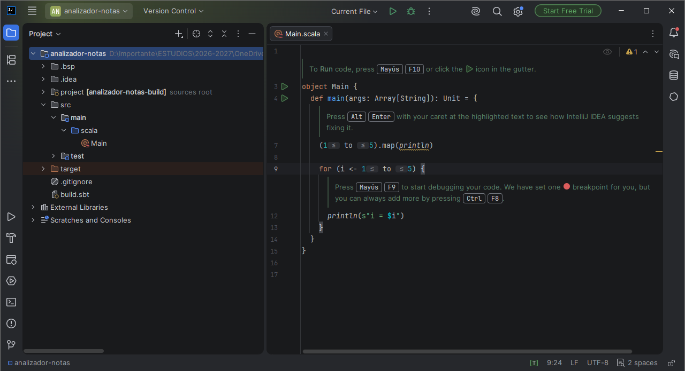 | El proyecto `analizador-notas` recién creado y cargado por sbt, con `src/main/scala/Main.scala` y el código de ejemplo que genera IntelliJ |
| 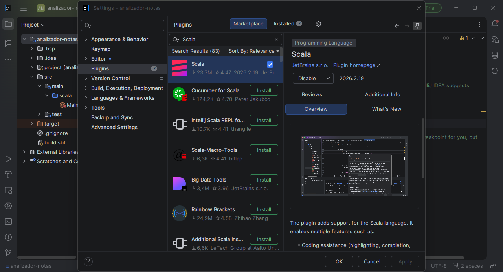 | *Settings → Plugins*: el plugin **Scala 2026.2.19** de JetBrains, activo |
| 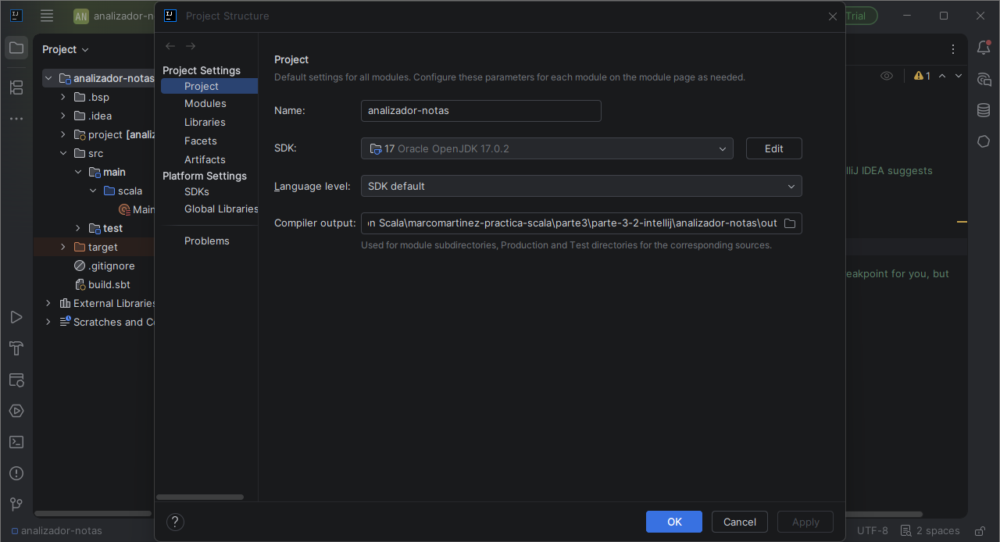 | *Project Structure → Project*: SDK **17 – Oracle OpenJDK 17.0.2** |
| 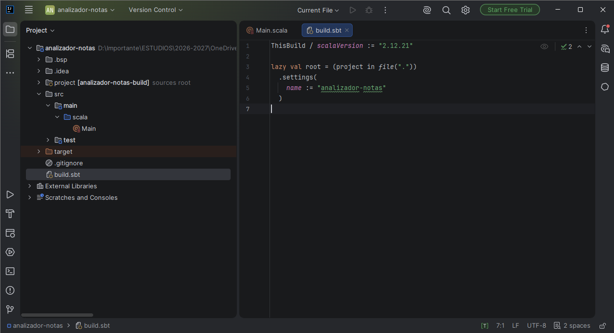 | `build.sbt` con `scalaVersion := "2.12.21"` y el nombre del proyecto |

En el asistente *New Project* elegí **sbt 1.12.13** en lugar de la 2.0.9 que propone por defecto. En la Parte 1 dejé la que venía marcada y el proyecto acabó con dos módulos y un `ClassNotFoundException: Main` al ejecutar; cambiándola a mano desde el principio, aquí el proyecto funcionó a la primera.

## Descripción

El programa analiza las calificaciones de un grupo de cinco estudiantes en dos evaluaciones. Para cada evaluación muestra quién aprueba y quién suspende, un resumen con el número de aprobados, de suspensos y la nota más alta, y un segundo listado con la clasificación de cada nota (EXCELENTE, NOTABLE, APROBADO o SUSPENSO). Al final compara las dos evaluaciones y dice si el grupo ha mejorado, ha empeorado o se ha mantenido igual, y añade un estudiante nuevo a la lista con `::` para comprobar que la lista original no cambia.

## Estructura

```text
parte-3-2-intellij/
├── README.md                      ← este archivo
└── analizador-notas/
    ├── .gitignore
    ├── build.sbt
    ├── project/
    │   └── build.properties
    └── src/
        ├── main/
        │   └── scala/
        │       └── Main.scala
        └── test/
            └── scala/
```

| Archivo o carpeta | Para qué sirve |
|---|---|
| [`build.sbt`](analizador-notas/build.sbt) | Nombre del proyecto y versión de Scala (2.12.21) |
| [`project/build.properties`](analizador-notas/project/build.properties) | Fija la versión de sbt del proyecto (1.12.13) |
| [`src/main/scala/Main.scala`](analizador-notas/src/main/scala/Main.scala) | Todo el programa: datos, funciones y las dos evaluaciones |
| `src/test/scala/` | Carpeta de tests que crea el asistente. Vacía en esta práctica |
| [`.gitignore`](analizador-notas/.gitignore) | El que genera IntelliJ: deja fuera `target/`, `out/`, `.bsp/`, parte de `.idea/` y los `*.iml` |

El `build.sbt` que genera IntelliJ está escrito de otra forma que el del enunciado, pero configura lo mismo:

```scala
ThisBuild / scalaVersion := "2.12.21"

lazy val root = (project in file("."))
  .settings(
    name := "analizador-notas"
  )
```

`ThisBuild / scalaVersion` fija la versión de Scala para todo el build, y el `name` va dentro de los ajustes del proyecto raíz en lugar de suelto.

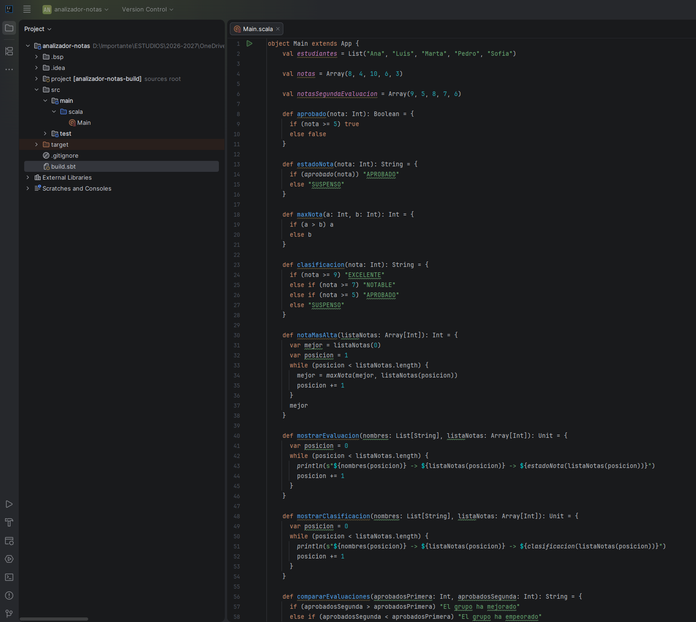

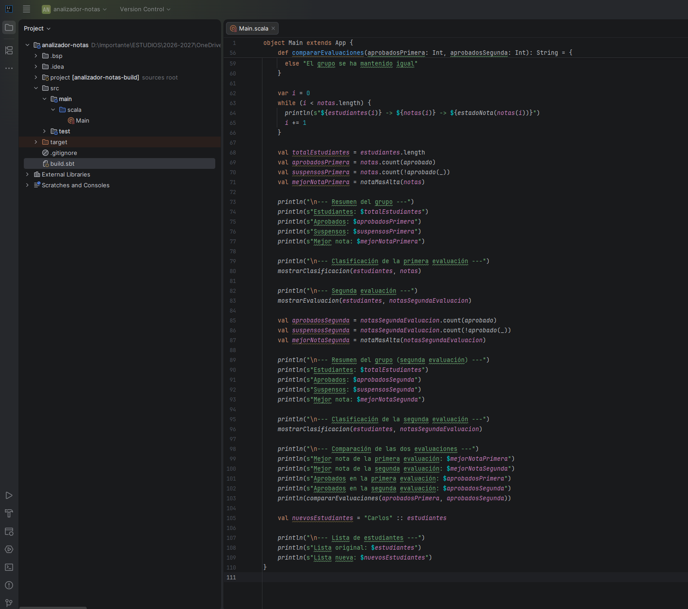

## Datos iniciales

```scala
val estudiantes = List("Ana", "Luis", "Marta", "Pedro", "Sofia")

val notas = Array(8, 4, 10, 6, 3)

val notasSegundaEvaluacion = Array(9, 5, 8, 7, 6)
```

Los nombres van en una `List` y las notas en un `Array`, y se relacionan por la posición: `estudiantes(0)` tiene la nota de `notas(0)`. La lista de estudiantes es la misma para las dos evaluaciones; lo único que cambia es el array de notas que se le pasa a cada función.

## Funciones utilizadas

| Función | Qué hace |
|---|---|
| `aprobado(nota: Int): Boolean` | Devuelve `true` si la nota es 5 o más |
| `estadoNota(nota: Int): String` | Devuelve `"APROBADO"` o `"SUSPENSO"` según lo que diga `aprobado` |
| `maxNota(a: Int, b: Int): Int` | Devuelve la mayor de dos notas con `if` / `else` |
| `clasificacion(nota: Int): String` | Clasifica la nota con `if` / `else if` / `else`: EXCELENTE (9-10), NOTABLE (7-8), APROBADO (5-6) y SUSPENSO (0-4) |
| `notaMasAlta(listaNotas: Array[Int]): Int` | Recorre el array con `while` y va quedándose con la mayor usando `maxNota` |
| `mostrarEvaluacion(nombres: List[String], listaNotas: Array[Int]): Unit` | Imprime el listado `nombre -> nota -> estado` de una evaluación |
| `mostrarClasificacion(nombres: List[String], listaNotas: Array[Int]): Unit` | Imprime el listado `nombre -> nota -> clasificación` |
| `compararEvaluaciones(aprobadosPrimera: Int, aprobadosSegunda: Int): String` | Compara el número de aprobados y devuelve si el grupo ha mejorado, ha empeorado o se ha mantenido igual |

`aprobado` es la base: `estadoNota` la usa para el texto y los resúmenes la usan con `count` para contar aprobados y suspensos. `notaMasAlta` es la que le da uso real a `maxNota`, que por sí sola solo compara dos números.

Las funciones que reciben el array (`notaMasAlta`, `mostrarEvaluacion`, `mostrarClasificacion`) son las que permiten analizar la segunda evaluación sin repetir el código: se llaman otra vez cambiando solo el array de notas.

## Recorridos

El primer listado va con un `while` suelto, como pide el enunciado:

```scala
var i = 0
while (i < notas.length) {
  println(s"${estudiantes(i)} -> ${notas(i)} -> ${estadoNota(notas(i))}")
  i += 1
}
```

Los demás recorridos están dentro de funciones, pero usan el mismo `while` con un contador. En este mini proyecto no uso `foreach`: es el 3.1 el que pide comparar las dos formas de recorrer, y allí está explicado.

## Uso de listas: por qué la lista original no cambia

```scala
val nuevosEstudiantes = "Carlos" :: estudiantes
```

`::` no añade el elemento a `estudiantes`: crea una **lista nueva** cuyo primer elemento es `"Carlos"` y cuyo resto es la lista que ya existía. Las `List` de Scala son inmutables, así que `estudiantes` no se puede modificar; lo que hace `::` es reutilizarla entera como cola de la lista nueva, sin copiarla. Por eso al imprimir las dos al final, la original sigue teniendo cinco nombres y la nueva tiene seis.

Además, `estudiantes` está declarada con `val`, así que tampoco se le podría asignar otra lista: haría falta un `var`, y aun así la lista en sí seguiría siendo inmutable.

## Ejecución

El programa lo he ejecutado de las dos formas.

**Desde IntelliJ**, con el triángulo verde junto a `object Main`:

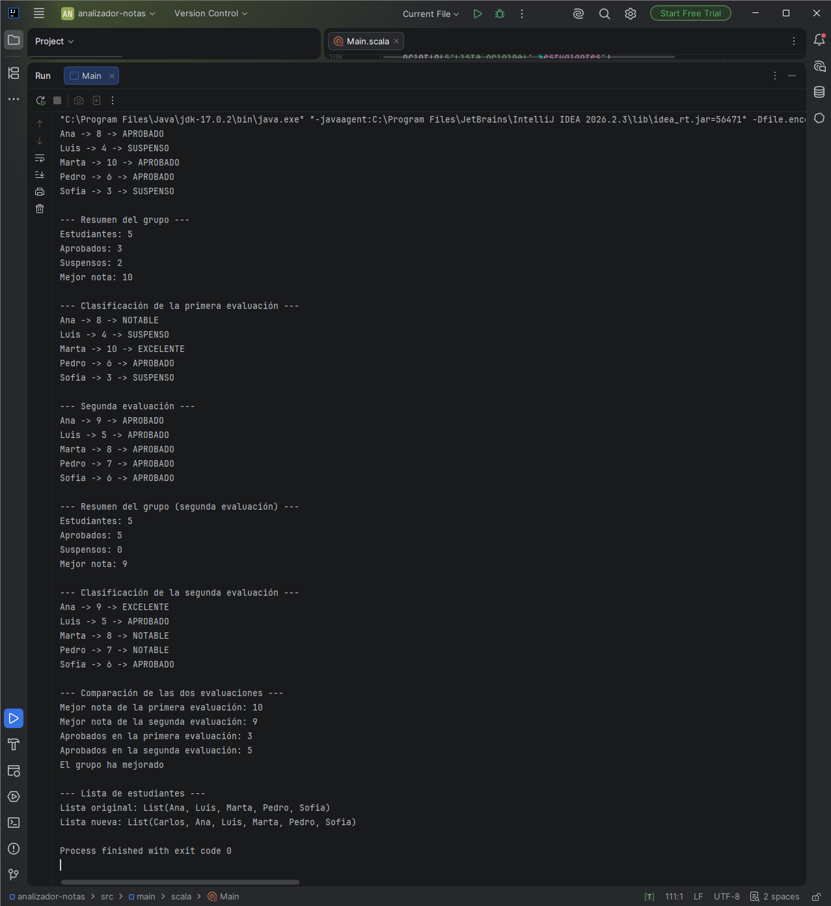

Termina con `Process finished with exit code 0`.

**Con sbt desde la terminal integrada** (`Alt+F12`):

```bat
sbt compile
sbt run
```

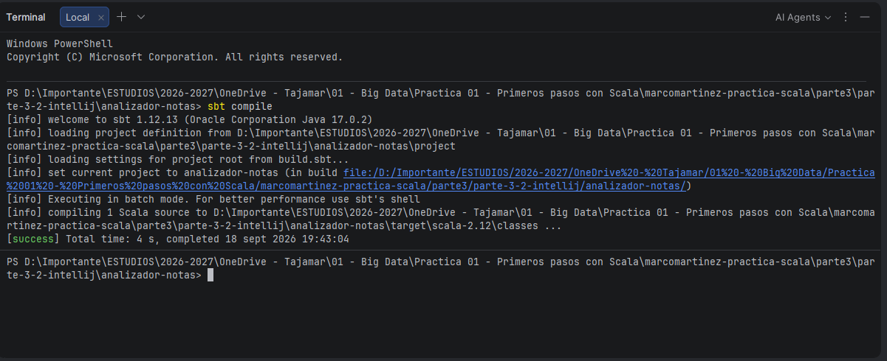

`sbt compile` termina con `[success] Total time: 4 s` y confirma que usa sbt 1.12.13 sobre Java 17.0.2.

## Resultados

Salida completa de `sbt run`:

```text
[info] running Main
Ana -> 8 -> APROBADO
Luis -> 4 -> SUSPENSO
Marta -> 10 -> APROBADO
Pedro -> 6 -> APROBADO
Sofia -> 3 -> SUSPENSO

--- Resumen del grupo ---
Estudiantes: 5
Aprobados: 3
Suspensos: 2
Mejor nota: 10

--- Clasificación de la primera evaluación ---
Ana -> 8 -> NOTABLE
Luis -> 4 -> SUSPENSO
Marta -> 10 -> EXCELENTE
Pedro -> 6 -> APROBADO
Sofia -> 3 -> SUSPENSO

--- Segunda evaluación ---
Ana -> 9 -> APROBADO
Luis -> 5 -> APROBADO
Marta -> 8 -> APROBADO
Pedro -> 7 -> APROBADO
Sofia -> 6 -> APROBADO

--- Resumen del grupo (segunda evaluación) ---
Estudiantes: 5
Aprobados: 5
Suspensos: 0
Mejor nota: 9

--- Clasificación de la segunda evaluación ---
Ana -> 9 -> EXCELENTE
Luis -> 5 -> APROBADO
Marta -> 8 -> NOTABLE
Pedro -> 7 -> NOTABLE
Sofia -> 6 -> APROBADO

--- Comparación de las dos evaluaciones ---
Mejor nota de la primera evaluación: 10
Mejor nota de la segunda evaluación: 9
Aprobados en la primera evaluación: 3
Aprobados en la segunda evaluación: 5
El grupo ha mejorado

--- Lista de estudiantes ---
Lista original: List(Ana, Luis, Marta, Pedro, Sofia)
Lista nueva: List(Carlos, Ana, Luis, Marta, Pedro, Sofia)
[success] Total time: 1 s, completed 18 sept 2026 19:45:42
```

**Primera evaluación**

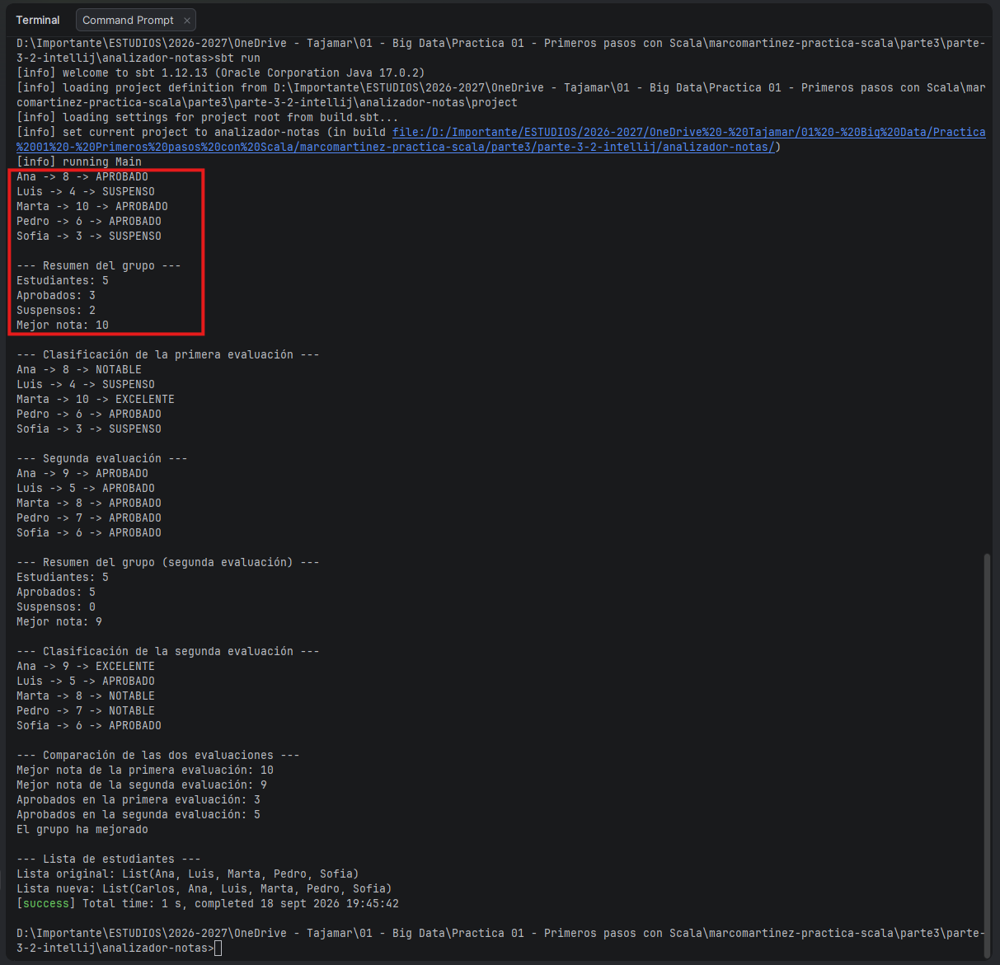

Aprueban Ana, Marta y Pedro; suspenden Luis (4) y Sofia (3). La mejor nota es el 10 de Marta.

**Clasificación**

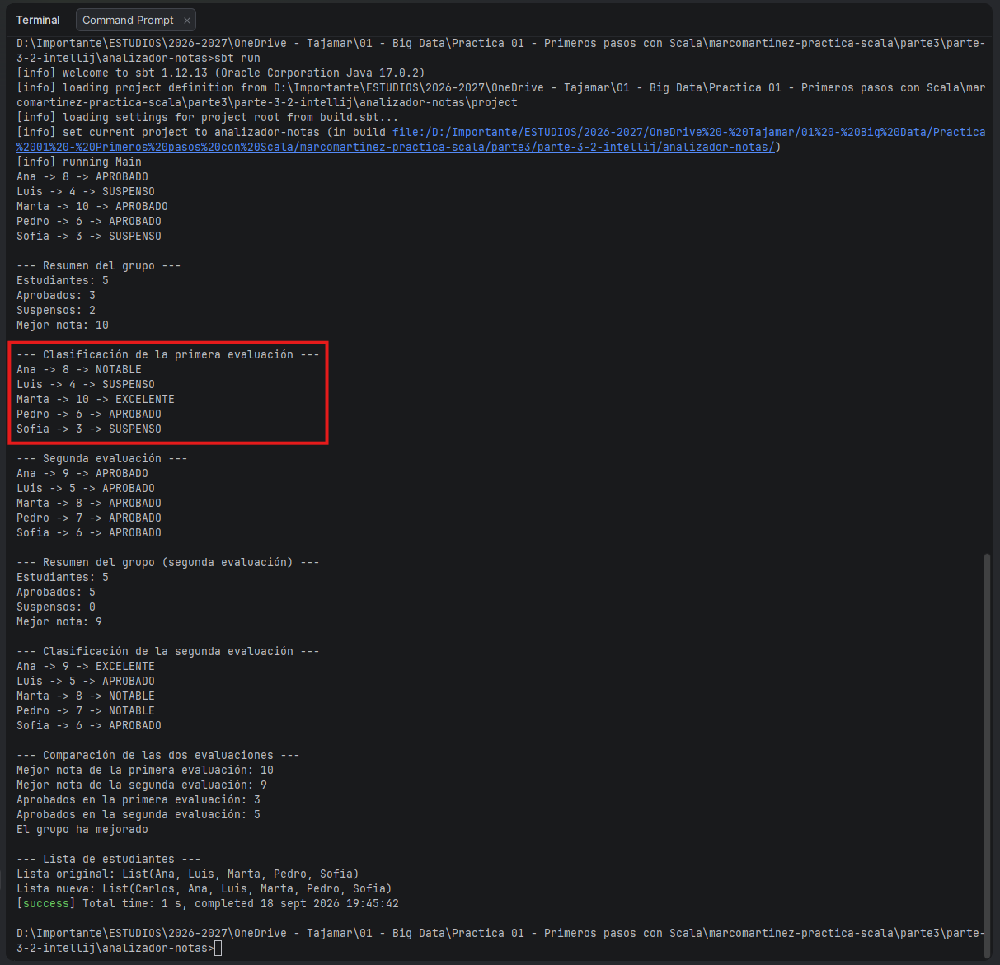

El mismo listado pero con la clasificación: el 8 de Ana es NOTABLE, el 10 de Marta EXCELENTE y el 6 de Pedro APROBADO. Los dos suspensos se quedan en SUSPENSO, igual que en el listado anterior.

**Comparación de las dos evaluaciones**

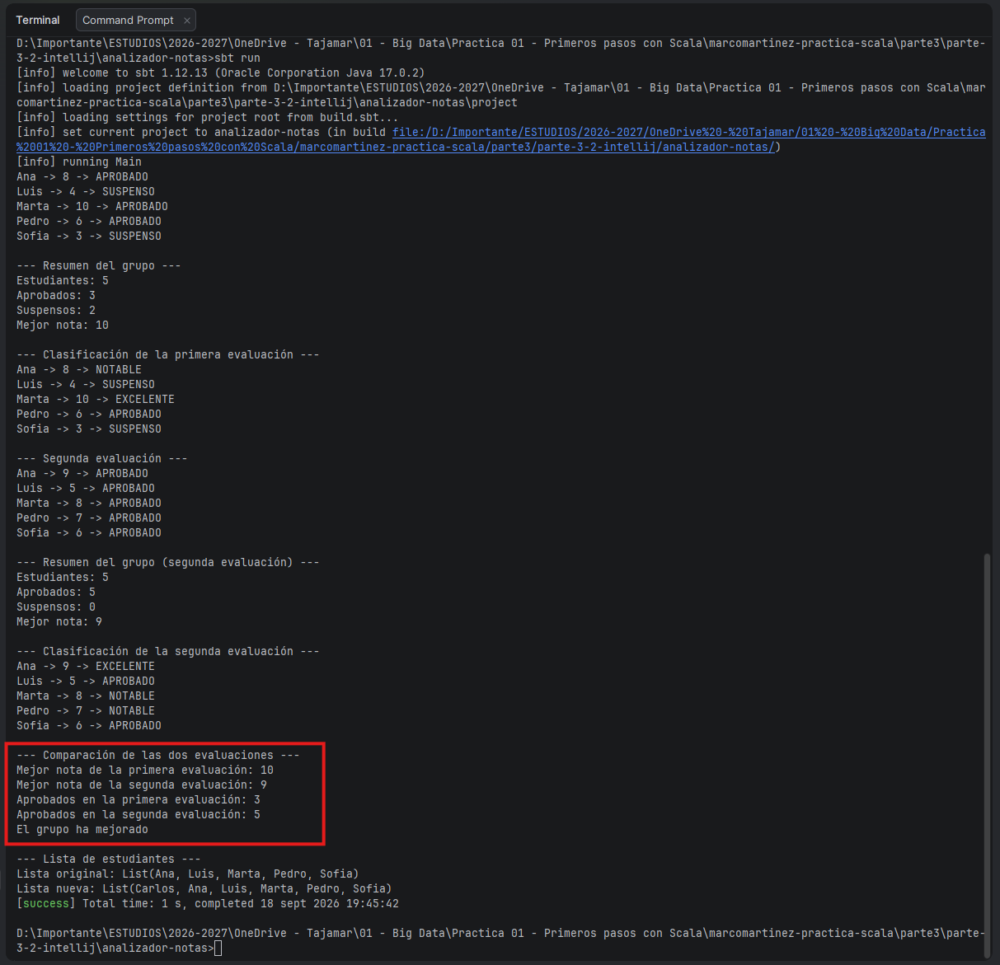

Aquí se ve por qué el enunciado pide comparar por número de aprobados y no por la mejor nota: en la segunda evaluación aprueba todo el grupo (5 frente a 3), pero la nota más alta baja de 10 a 9. Si la comparación se hiciera por la mejor nota, el resultado sería el contrario.

**Listas**

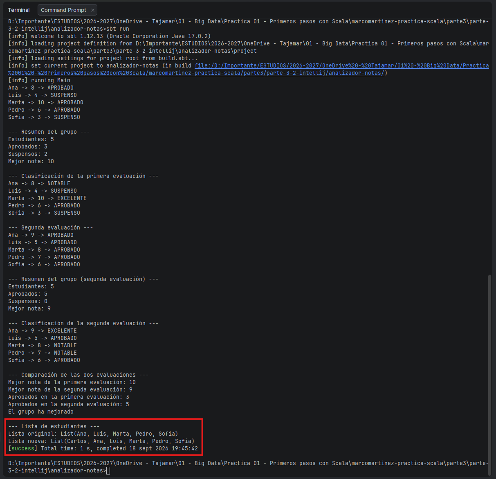

La lista original sigue con los cinco nombres y la nueva tiene seis, con Carlos al principio.

## Problema encontrado: las tildes en la terminal

En la Parte 1 dejé este problema documentado pero sin resolver, así que aquí lo he arreglado.

La salida tiene tildes (`Clasificación`, `evaluación`, `Comparación`) y la terminal de IntelliJ abre PowerShell por defecto, donde `chcp 65001` no surte efecto porque la sesión fija su codificación al abrirse. La solución fue cambiar la terminal a **Command Prompt** (*Settings → Tools → Terminal*, o la pestaña `+` de la terminal) y ahí sí:

```bat
chcp 65001
sbt run
```

Con eso la salida sale correcta, que es la de las capturas. `sbt compile` lo dejé en PowerShell porque solo imprime mensajes de sbt, sin texto mío.

Desde el botón *Run* de IntelliJ las tildes salen bien sin tocar nada: en la primera línea de la captura se ve que IntelliJ lanza la JVM con `-Dfile.encoding=UTF-8`, mientras que la consola de Windows usa por defecto otra página de códigos.

## Notas sobre el enunciado

- **`object Main extends App`.** Aquí uso la forma que pide el enunciado. En la Parte 1 el proyecto de IntelliJ se quedó con el `def main(args: Array[String])` que genera el asistente; las dos son equivalentes y están explicadas en el [Entorno 3](../../parte1/entorno3-intellij.md).
- **Clasificación por rangos.** `clasificacion` compara con `>=` en cascada (`>= 9`, `>= 7`, `>= 5`) en lugar de comprobar valor a valor. Como los `else if` se evalúan en orden, cada nota cae en el primer rango que cumple, y el `else` final recoge todo lo que quede por debajo de 5.
- **Recuentos con `count`.** Para contar aprobados y suspensos uso `notas.count(aprobado)` y `notas.count(!aprobado(_))` en lugar de llevar contadores dentro del `while`, igual que hice en el [mini proyecto 3.1](../parte-3-1-vscode/README.md).
- **Capturas.** Están en `parte3/images/` con el prefijo `p32-`.

[← Volver a la Parte 3](../README.md) · [Mini proyecto 3.1](../parte-3-1-vscode/README.md)
